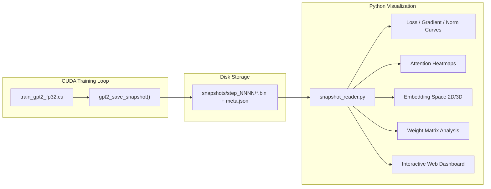

# Training Process Visualization System

## Architecture



The system is **record-then-visualize** (offline), keeping training maximally fast. Real-time streaming can be layered on later using the same snapshot format.

---

## Part 1: C-Side Snapshot Recorder

Add to [src/train_gpt2_fp32.cu](src/train_gpt2_fp32.cu):

### What to Record (per snapshot)

| Data | Source | Size (small model, ~400K) | Size (dev model, ~7M) | Why |
|------|--------|---------------------------|----------------------|-----|
| **All parameters** | `params_memory` | 1.6 MB | 28 MB | Weight evolution, SVD analysis, norm tracking |
| **Parameter gradients** | `grads_memory` | 1.6 MB | 28 MB | Gradient flow analysis per layer |
| **Attention weights** | `acts.att` (L,B,NH,T,T) | ~8 KB (L=2,B=1,NH=4,T=8) | ~8 MB (L=4,B=4,NH=4,T=256) | How attention patterns evolve |
| **Residual stream** | `acts.encoded`, `acts.residual3` per layer | ~8 KB | ~1 MB | Activation flow through layers |
| **Optimizer state norms** | Per-tensor L2 of `m_memory`, `v_memory` | ~128 B | ~128 B | Adam momentum/variance dynamics |
| **Scalar metrics** | `mean_loss`, step, lr | ~32 B | ~32 B | Training curves |

For the **small model** (~400K params): full snapshot is ~3.2 MB. At 1000 snapshots over 100K steps = ~3.2 GB total -- very manageable.

For the **dev model** (~7M params): full snapshot is ~65 MB. Save every 100 steps over 2K steps = ~1.3 GB -- fine.

### Snapshot Format

```
snapshots/
  manifest.json              # model config, tensor shapes, tensor offsets
  step_000000.bin            # flat binary: params | grads | att | residuals | optimizer_norms | scalars
  step_001000.bin
  ...
```

A single binary file per step with a fixed layout (described in `manifest.json`) is simplest -- no directory creation overhead, easy to mmap, trivial to read in numpy. The manifest records byte offsets and shapes for each tensor section.

### CLI Flags

Consistent with existing `-v`, `-s`, `-k` flag style:

| Flag | Description | Default |
|------|-------------|---------|
| `-d <path>` | Snapshot output directory | NULL (disabled) |
| `-f <int>` | Snapshot frequency (every N steps) | 100 |

### Implementation

A single function `gpt2_save_snapshot(GPT2* model, const char* dir, int step)` that:
1. Copies GPU tensors to CPU via `cudaMemcpy`
2. Computes per-tensor gradient and optimizer norms on CPU
3. Writes a single flat binary file `step_NNNNNN.bin`
4. On first call, writes `manifest.json` with shapes and offsets

The function is called from the training loop alongside existing checkpoint/logging hooks.

For **attention weights specifically**: the `att` tensor (L, B, NH, T, T) is available after `gpt2_forward()` completes. We only need to save a representative sample (e.g., first batch element) to keep size small.

---

## Part 2: Python Visualization Toolkit

A Python package in `viz/` with:

### 2a. Snapshot Reader (`viz/snapshot_reader.py`)

Reads `manifest.json` + binary files, returns named numpy arrays. Core utility used by all visualizers.

### 2b. Training Dynamics Dashboard (`viz/dashboard.py`)

**2D plots** (matplotlib):
- **Loss curves**: train/val loss vs. step (from scalar metrics)
- **Gradient norms per layer**: L2 norm of each of the 16 parameter tensors over training -- shows gradient flow health
- **Weight norms per layer**: L2 norm of each parameter tensor over training -- shows weight decay effect
- **Adam state**: momentum and variance norms -- shows optimizer convergence
- **Parameter change rate**: L2(params[t] - params[t-1]) per tensor -- shows which layers are changing fastest

This directly answers questions from the grokking experiment: when does the model transition from memorization to generalization? Which layers change during the transition?

### 2c. Attention Pattern Visualizer (`viz/attention.py`)

**2D heatmaps** (matplotlib/seaborn):
- Attention weight matrices per head per layer for a given input
- Side-by-side comparison across training steps (e.g., step 1000 vs 50000 vs 100000)
- Animated GIF/MP4 of attention evolution over training

For the **modular arithmetic task**, this shows:
- Do heads specialize? (one head for `a`, another for `b`?)
- When do attention patterns change during grokking?

### 2d. Embedding Space Visualizer (`viz/embeddings.py`)

**2D and 3D** (plotly for interactivity):
- Token embeddings (`wte`) projected via PCA, t-SNE, or UMAP to 2D/3D
- Position embeddings (`wpe`) similarly projected
- Colored by token identity (for mod-97: residue value, special tokens)
- **Animated**: slider over training steps to watch structure emerge

For the **modular arithmetic task**, this is especially interesting: the paper predicts Fourier/circular structure in embeddings. We can watch the 97 residue embeddings organize into a circle as generalization happens.

### 2e. Weight Matrix Visualizer (`viz/weights.py`)

**2D heatmaps + SVD analysis**:
- Heatmaps of key weight matrices (QKV projection, FC layers) -- shows sparsity patterns, structure
- Singular value spectrum of weight matrices over training -- shows rank and effective dimensionality
- Weight histogram distributions per layer (detect dead neurons, saturation)

### 2f. Interactive Explorer (`viz/explorer.py`)

A **Dash web app** or **Jupyter notebook** that combines all visualizations:
- Step slider to scrub through training
- Layer/head dropdowns
- Synchronized views: select a step and see attention + embeddings + weights simultaneously
- Plotly 3D for rotation/zoom of embedding spaces

---

## Recommended Implementation Order

Start with the **small model** (experiment 10, modular arithmetic) because:
- Tiny tensors = fast iteration, small snapshots
- Known phenomenon (grokking) provides ground truth for "is the visualization showing something meaningful?"
- Rich structure to discover (Fourier features, attention specialization)

1. C snapshot recorder
2. Python snapshot reader
3. Training dynamics dashboard (loss, gradient norms, weight norms)
4. Attention heatmaps
5. Embedding space 3D visualizer
6. Weight matrix / SVD analysis
7. Interactive explorer (Dash or Jupyter)

---

## Technology Choices

| Component | Tool | Rationale |
|-----------|------|-----------|
| Snapshot format | Raw binary + JSON manifest | Zero dependencies in C, trivial numpy read |
| 2D plots | matplotlib | Already familiar, publication quality |
| 3D plots | plotly | Interactive rotation/zoom, works in browser and Jupyter |
| Dimensionality reduction | sklearn (PCA, t-SNE), umap-learn | Standard, well-tested |
| Interactive dashboard | Dash or Jupyter + ipywidgets | Low overhead, Python-native |
| Animation | matplotlib.animation or plotly frames | GIF/MP4 export for sharing |

### Python Dependencies

```
numpy matplotlib plotly dash scikit-learn umap-learn imageio
```

---

## Key Research Questions This Enables

1. **Grokking visualization**: What changes in attention/embeddings/weights at the memorization-to-generalization transition?
2. **Fourier features**: Do mod-97 token embeddings form circular structure? When?
3. **Gradient flow**: Which layers receive the most gradient? Does this change during grokking?
4. **Banded sparsity**: (Experiments 7-9) How do banded weight constraints affect learned representations?
5. **Architecture understanding**: How do residual stream magnitudes, LayerNorm statistics, and GELU activation patterns evolve?
