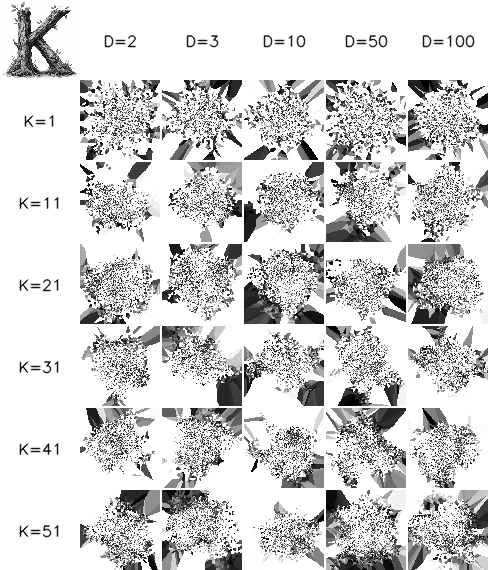
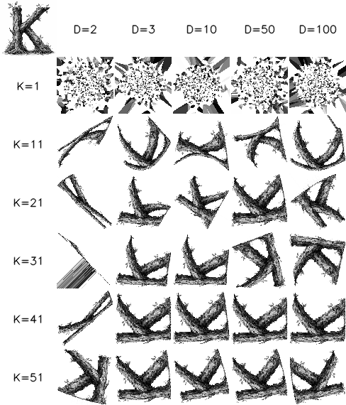

# Experiment: Continuous Position Drift

**Date:** 2026-03-08
**Status:** In Progress
**Source:** *tagged on completion as `exp/ts-00002`*

## Goal

Replace the discrete grid swap mechanism with learned continuous position vectors. Each neuron gets a float coordinate that drifts freely under the same Hebbian attraction rule — no grid, no swaps, no conflict resolution.

## Hypothesis

1. Continuous positions will converge faster than discrete grid swaps because there are no conflict rejections and neurons can move fractional distances per step (no rounding to ±1).
2. The algorithm becomes trivially parallel — every neuron updates independently, no swap conflicts to resolve.
3. Extending position vectors beyond 2D will allow the system to capture affinity structure that a 2D grid cannot represent.
4. The approach is fully differentiable, opening the door to gradient-based optimization of the affinity function itself.

## Method

### Approach

Each neuron `i` has:
- A **position vector** `p[i]` — unconstrained float, initialized randomly. Starts as 2D but the dimensionality is a hyperparameter.
- A **top-K neighbor list** — same as experiment 00001, precomputed from ideal affinity.

Each tick, for every neuron:
1. Look up current positions of its K neighbors: `p[top_k[i]]`
2. Compute centroid: `c[i] = mean(p[top_k[i]])`
3. Compute delta: `d[i] = c[i] - p[i]`
4. Apply soft margin (tanh suppression): `d[i] *= tanh(|d[i]| / margin)`
5. Update position: `p[i] += lr * d[i]`
6. Rescale all positions to fill [0, width) × [0, height) (prevents collapse to a point)

The soft margin makes the step quadratic near the centroid (slow when close) and linear when far (normal speed). This slows over-convergence without hard freezing.

For dims > 2, rendering uses PCA projection to find the 2D plane capturing the most variance, then Voronoi assignment to the grid.

### Rendering

To produce an image from continuous positions, quantize to a 2D grid at display time:
- For 2D positions: round each neuron's position to nearest grid cell, resolve collisions (e.g., closest neuron wins).
- For N-D positions: project to 2D (PCA or first two dimensions), then quantize.

The continuous state is the ground truth; the grid image is just a visualization.

### Key differences from experiment 00001

| | Discrete (00001) | Continuous (00002) |
|---|---|---|
| State | Integer grid positions | Float position vectors |
| Movement | Swap with neighbor, ±1 step | Lerp toward centroid, any distance |
| Conflicts | Must resolve (priority scheme) | None — all updates independent |
| Parallelism | Partial (conflict rejection) | Full — every neuron every tick |
| Differentiable | No | Yes |
| Dimensionality | Fixed 2D grid | Arbitrary (2D, 3D, ...) |
| Rendering | Direct (grid = output) | Requires quantization step |

### Parameters to explore

- **Learning rate**: step size toward centroid. Too high = oscillation, too low = slow convergence.
- **K**: number of neighbors (same as 00001, expect similar sweet spot ~20-30).
- **Dimensionality**: 2D, 3D, higher. Does higher-D produce better separation before projection?
- **Initialization**: random uniform, random normal, grid-aligned. Does it matter?
- **Momentum/decay**: add momentum to position updates? Weight decay to prevent drift?

### Setup
- Hardware: NVIDIA GPU with CuPy
- Dependencies: numpy, scipy, cupy, opencv-python-headless
- Dataset: K_80_g.png, K_160_g.png (same as 00001)

## Results

### Position collapse in low dimensions

The core discovery: pure centroid attraction is a **smoothing/diffusion** operator. Repeated averaging destroys spatial structure over time:

1. **Organization phase** (early ticks): neurons find their neighbors, the K shape forms. Recognizable by ~500-1000 ticks with lr=0.05.
2. **Collapse phase** (later ticks): continued averaging erodes 2D structure into 1D. Positions converge toward the dominant eigenvector of the neighbor-averaging operator — a line.

Without rescaling, all positions collapse to a single point. The per-tick rescaling (normalize min/max to fill the grid) prevents point collapse but cannot prevent dimensional collapse: a 1D structure stretched to 2D renders as a diagonal line with Voronoi stripe artifacts.

**Soft margin (tanh suppression)** slows but does not prevent collapse. The suppression reduces individual neuron movement near centroids, but the centroids themselves keep drifting because they are averages of moving neighbors. The margin parameter controls *when* collapse happens, not *whether*.

### High-dimensional embeddings solve collapse

**Key finding:** increasing the embedding dimensionality prevents the collapse entirely.

- **2D**: collapses to lines by ~5k-10k ticks (lr=0.05)
- **3D**: same collapse, slightly slower
- **10D+**: stable indefinitely — tested to 10M ticks with dims=16, structure unchanged from 500k onward

The mechanism: with D dimensions, the averaging operator converges to the top eigenvector in D-space. For D=2, this is 1D (a line). For D=16, this is still 1D in 16-space, but PCA projection finds the best 2D plane — and with 16 dimensions of variation, PCA always finds a good 2D projection that preserves the topographic structure.

### Grid search: K × dimensionality

30 experiments: K ∈ {1, 11, 21, 31, 41, 51} × dims ∈ {2, 3, 10, 50, 100}, all on K_80_g.png at 80×80, lr=0.05, margin=0.3, 100k ticks.

**Early (tick 100):**

**Final (tick 100k):**

**Findings:**

- **K=1 never converges** — same as experiment 00001. A single neighbor provides no useful gradient.
- **D=2 collapses** at all K values. K=11-21 shows partial K before collapsing; K=31+ collapses to pure lines.
- **D=3 helps slightly** but still degrades at 100k ticks.
- **D=10, 50, 100 produce similar quality** — diminishing returns past ~10D. All show solid, recognizable K shapes at K=11+.
- **K=21-51 with D≥10** is the sweet spot: clear K shapes, stable over time.
- **PCA projection** means each experiment finds a different orientation/reflection of the K — expected since there is no orientation constraint in the algorithm.

### Convergence speed

The continuous approach converges remarkably fast — recognizable K by ~500-1000 ticks vs ~5000-10000 for discrete greedy drift (experiment 00001). This confirms hypothesis 1: no conflict rejections + fractional movement = faster convergence.

### Long-term stability (dims=16)

Tested to 10M ticks with dims=16, K=24, lr=0.05, margin=1.0:
- Structure fully formed by ~100k ticks
- Virtually identical output from 500k through 10M ticks
- No collapse, no oscillation, no degradation

## Analysis

### Hypothesis outcomes

1. **Faster convergence** — **Confirmed.** ~5-10x faster than discrete greedy at same K.
2. **Trivially parallel** — **Confirmed.** No swap conflicts, every neuron updates independently. GPU time nearly constant regardless of grid size.
3. **Higher-D captures more structure** — **Confirmed, and critical.** Higher dimensionality is not just useful but *necessary* to prevent collapse. D≥10 solves the collapse problem entirely.
4. **Fully differentiable** — **Confirmed** in principle. The update rule is differentiable. Not yet exploited for gradient-based optimization of the affinity function.

### The collapse mechanism

The centroid-attraction update `p += lr * (centroid - p)` is equivalent to a weighted averaging filter applied to positions. Like repeatedly blurring an image, it progressively removes high-frequency spatial structure. In D dimensions, the positions converge to a rank-1 structure (the top eigenvector of the affinity-weighted averaging operator).

Rescaling prevents point collapse but not dimensional collapse. The key insight is that **the number of "surviving" dimensions after convergence equals 1** regardless of the initial dimensionality. But with D=16 initial dimensions, we lose 15→1 effective dimensions while PCA only needs 2 — so there are always enough dimensions of variation for a good 2D projection.

### Rendering limitations

The Voronoi rendering (each grid cell → nearest neuron) is fast but not bijective: some neurons own multiple cells, others own none. This creates visual artifacts but does not affect the underlying position structure. The continuous positions are the ground truth; the grid image is a lossy visualization.

## Next Steps

- [ ] Compare quantitatively with experiment 00001 (e.g., image correlation metric at matched tick counts)
- [ ] Explore learning rate schedules (decay LR over time to freeze structure)
- [ ] Try gradient-based optimization of affinity function (exploit differentiability)
- [ ] Test on larger grids (160×160, 320×320) with high-D embeddings
- [ ] Investigate whether the "optimal" dimensionality scales with grid size
