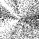
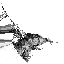
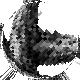

# Experiment: LayerNorm Embeddings

**Date:** 2026-03-09
**Status:** In Progress
**Source:** *tagged on completion as `exp/ts-00003`*

## Goal

Replace the min-max rescaling from experiment 00002 with proper LayerNorm (mean subtraction + standard deviation normalization). This makes embeddings resolution-agnostic, numerically stable for indefinite runtime, and compatible with future multimodal inputs.

## Motivation

Experiment 00002 used per-tick min-max rescaling to prevent position collapse. This works but has problems:

1. **Resolution-dependent**: rescaling maps to [0, width) × [0, height), tying embeddings to a specific grid size.
2. **Mean drift**: min-max only controls range, not center. Over long runs, the mean can drift, wasting float precision.
3. **Not universal**: future multimodal inputs (video, audio, other signals) need embeddings on a common scale regardless of source resolution.

LayerNorm (center + normalize) solves all three:
- Embeddings live on a unit-variance cloud centered at origin — no resolution dependency.
- Mean is reset every tick — no drift, numerically stable for years of runtime.
- Any input modality produces embeddings on the same scale.
- Rendering becomes a separate concern: project normalized embeddings to whatever grid size you need.

## Method

Replace `_rescale()` with `_normalize()` — LayerNorm applied across all neurons:

```python
positions -= positions.mean(axis=0)   # center cloud at origin
positions /= positions.std(axis=0)    # unit variance per dimension
```

Rendering now maps from normalized space to grid coordinates:
1. PCA projection to 2D (if dims > 2)
2. Scale to [0, width) × [0, height) at render time only

The embeddings themselves are resolution-agnostic — the grid size only matters for display.

### Changes from 00002
- `_rescale()` → `_normalize()` (LayerNorm)
- `_normalize_rmsnorm()` kept as alternative (center + per-vector unit length) — not used yet, needs adapted render
- Initialization: random normal instead of uniform-in-grid (matches normalized space)
- Render: PCA + min-max scaling moved to render-time only, works for any dims
- `position_stats()` reports `mean_norm` and `std_mean` instead of `spread_x`/`spread_y`
- Default margin reduced from 1.0 → 0.1 (distances are O(1) in normalized space, not O(width))

### Parameters
- Same as experiment 00002: lr=0.05, K, dims
- Margin: reduced default to 0.1; best results with margin=0 (no dead zone)

### Setup
- Hardware: NVIDIA GPU with CuPy
- Dependencies: numpy, scipy, cupy, opencv-python-headless
- Dataset: K_80_g.png (same as 00001, 00002)

## Log

### Test 1: LayerNorm + RMSNorm, dims=2, margin=0.1, 100k ticks


LayerNorm (per-dim std) followed by RMSNorm (per-vector unit length). Result: random rays of dots emanating from center. The per-vector normalization forces all points onto a circle (in 2D), destroying the spatial structure. `std=0.7071` (= 1/√2, expected for unit vectors in 2D).

### Test 2: LayerNorm only, dims=2, margin=0.1, 100k ticks


Removed RMSNorm, kept only LayerNorm. `std=1.0000`. Structure visible but dims=2 limits quality.

### Test 3: LayerNorm only, dims=16, K=25, margin=0.1, 500k ticks


Higher dimensionality with LayerNorm only. Clear K reconstruction, good quality. `std=1.0000` stable throughout.

### Test 4: RMSNorm (center + unit length), dims=16, K=25, margin=0.1, 500k ticks


Tried center + per-vector unit-length without per-dim std. `std=0.2181` (≈ 1/√16). PCA projection of hypersphere concentrates points in center, creating a magnified center region with artifacts on a circular border. **RMSNorm needs an adapted render** (e.g., radial equalization) before it's usable.

### Test 5: RMSNorm, dims=16, K=25, margin=0, 500k ticks


Same as test 4 but with margin=0. Similar artifacts — confirms the display issue is from hypersphere projection, not the margin parameter.

### Test 6: LayerNorm only, dims=16, K=25, margin=0, 100k ticks


Best result. LayerNorm only, no margin dead zone. Clean K reconstruction at 100k ticks. `mean_norm=0.0000, std=1.0000`. Margin=0 works well — the LayerNorm itself prevents collapse, so the tanh dead zone is unnecessary.

## Findings So Far

1. **LayerNorm works**: center + per-dim std normalization produces stable, resolution-agnostic embeddings with `std=1.0` and `mean_norm=0.0` indefinitely.
2. **RMSNorm breaks display**: per-vector unit-length normalization constrains points to a hypersphere, which PCA projects as a disk with density concentrated at center. Needs adapted rendering before it's useful.
3. **Margin=0 is fine**: the tanh dead zone (margin parameter) is unnecessary with LayerNorm — normalization prevents collapse on its own. Removing it simplifies the system and gives clean results.
4. **dims=16 with K=25 works well**: consistent with 00002 findings on higher dimensionality.
5. **Per-vector magnitude drift**: LayerNorm controls per-dimension population stats but does NOT prevent individual vectors from drifting in magnitude. Over 1M ticks (dims=16, K=25, margin=0):
   - Element min/max stays stable at ~±1.95 (LayerNorm working as intended)
   - But per-vector norms diverge: min 1.64→0.006 (collapsing), max 7.16→7.77 (growing), mean 3.94→3.29
   - Neurons near cluster centers shrink (pulled uniformly from all sides), neurons at cluster boundaries grow
   - This is the gap RMSNorm was meant to fill — per-vector magnitude regularization is needed for long-term stability

## Next Steps

- [x] Replace `_rescale()` with LayerNorm in ContinuousDrift solver
- [x] Verify convergence on K_80_g.png matches or exceeds 00002 quality
- [ ] Run grid search: K × dims (same grid as 00002 for direct comparison)
- [ ] Test long-term stability (10M+ ticks) — verify no drift or overflow
- [ ] Fix per-vector magnitude drift: either RMSNorm with adapted rendering, or hybrid (LayerNorm + soft magnitude clamp)
- [ ] Document final results and compare with 00002
