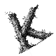
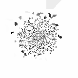
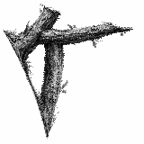

# Experiment: Temporal Correlation Learning

**Date:** 2026-03-09
**Status:** In Progress
**Source:** *tagged on completion as `exp/ts-00004`*

## Goal

Replace precomputed top-K neighbor lists with learned similarity from temporal correlations. Each neuron accumulates a time-series of its pixel values and discovers its neighbors by correlating with randomly sampled peers. This is the first step toward self-organizing embeddings without external similarity labels.

## Motivation

Experiments 00001–00003 all rely on precomputed top-K neighbors derived from pixel proximity in the input image. The system is told who's similar — it only learns where to place them. Real self-organization requires discovering similarity from raw input signals.

Temporal correlation is a natural mechanism: neurons that receive similar input patterns over time should cluster together. This mirrors Hebbian learning — "neurons that fire together wire together."

## Method

### Core Update Loop

Each tick, every neuron randomly samples P peers and updates its embedding:

```python
for each of P random peers j:
    sim = similarity(buffer[i], buffer[j])   # from precomputed buffers
    delta = positions[j] - positions[i]
    positions[i] += lr * sim * delta         # pull proportional to similarity
```

No precomputed neighbor list — similarity is computed on-the-fly from buffer vectors. LayerNorm normalization from experiment 00003 prevents collapse.

### Buffer Sources

Three buffer sources implemented (`--buf-source`), all precomputed at startup:

#### 1. Synthetic (default, `--buf-source synthetic`)

Use (x, y) grid coordinates as 2-element buffer vectors. Similarity computed via Gaussian RBF kernel:

```python
sim(i, j) = exp(-||pos_i - pos_j||² / (2σ²))   # in [0, 1]
```

Clean, strong signal. Sigma controls correlation radius. **This is the working baseline for developing the sampling mechanism.**

#### 2. Gaussian fields (`--buf-source gaussian`)

Generate T spatially smooth random fields (Gaussian-blurred white noise), fill circular buffers. Similarity via Pearson correlation. Signal is very weak — with T=200, correlations are ~0.005 for adjacent pixels, buried in noise. Needs T >> 200 for usable signal.

#### 3. Converged embeddings (`--buf-source embeddings`)

Run ContinuousDrift (exp 00003) to convergence, use the learned 16-dim position vectors as buffers. Similarity via Pearson. **Broken** — the per-vector magnitude drift from exp 00003 (finding #5) makes correlations unreliable: collapsed vectors (norm → 0) create noise that swamps the signal.

### Phase 2: Real Time-Series (Future)

- Feed actual pixel values each tick into circular buffers
- Correlation computed from temporal co-occurrence
- System discovers similarity from raw input — no precomputed neighbors

### Parameters
- `P`: number of random peers per neuron per tick
- `sigma`: Gaussian RBF kernel width (for synthetic source)
- `lr`: learning rate for similarity-driven updates
- `dims`: position vector dimensionality
- Normalization: LayerNorm from experiment 00003

## Log

### Test 1: Gaussian buffers, P=1, sigma=5, dims=16, 100k ticks

Spatially smooth random fields, Pearson correlation. Very noisy output — some dark/light clustering but no recognizable structure. Signal too weak with T=200.

### Test 2: Gaussian buffers, P=5, sigma=5, dims=16, 100k ticks

More peers per tick. Better clustering, K shape starting to emerge but still noisy.

### Test 3: Gaussian buffers, P=10, sigma=5, dims=16, 200k ticks

K clearly emerging but still noisier than precomputed top-K. Gaussian field correlations are fundamentally weak at T=200.

### Correlation analysis: Gaussian buffers

Measured Pearson correlation vs spatial distance for T=200, sigma=5:
- Adjacent pixels: mean corr = +0.005
- Distance 15+: mean corr ≈ 0
- Signal-to-noise ratio is terrible — the 1/T noise floor dominates

### Test 4: Converged embeddings, P=10, dims=16, 100k ticks

Used exp 00003 embeddings (16-dim) as buffer vectors. Output was random noise. Investigation showed:
- With only 16 "time steps", Pearson max is ±1/16 = ±0.0625
- Per-vector magnitude drift from exp 00003 means some vectors have norm 0.006 — after normalization they point in random directions
- Both Pearson and cosine similarity give min/max spanning the full range at every distance bin
- Raw dot product also fails: ref vector norm = 0.13, mean signal ≈ 0.02, swamped by variance

**Key insight:** The problem wasn't the correlation method — it was the buffer vectors themselves. Short vectors + magnitude drift = no usable signal.

### Test 5: Synthetic (x,y) + Gaussian RBF, P=10, sigma=5, dims=16, 100k ticks

Clean K reconstruction. Gaussian RBF on grid coordinates gives a strong, noise-free similarity signal. This proves the random-pairing + similarity-driven update loop works when the signal is good.

### Test 6: Synthetic, P=1, sigma=5, dims=16, 10k ticks


Just 1 random peer per neuron per tick. Already clear K structure at only 10k ticks. Remarkably efficient — each tick is O(n) with minimal compute.

### Test 7: Synthetic, P=1, sigma=5, dims=16, 50k ticks


P=1 at 50k ticks. Clean K, comparable quality to precomputed top-K (exp 00003 test6 at 100k). **P=1 is sufficient** when the similarity signal is strong — no need for multiple peers per tick.

### Test 8: Synthetic, P=1, sigma=5, dims=16, threshold=0.02, 50k ticks

Added repulsion: `sim = rbf - 0.02`, so distant peers (sim < 0.02) push apart. K visible but distorted/rotated compared to test 7. Most random pairs are far apart (sim≈0), so the -0.02 push is weak but adds noise. **Threshold repulsion not clearly beneficial** with random sampling — LayerNorm already prevents collapse.

### Scaling to 160px

### Test 9: Synthetic, P=1, sigma=5, dims=16, 160px, 50k ticks

4x more neurons (25,600). K emerging but noisy — sigma=5 is a small neighborhood relative to 160px grid, and P=1 means few useful interactions per tick.

### Test 10: Synthetic, P=5, sigma=5, dims=16, 160px, 50k ticks

P=5 peers. Much cleaner — clear K structure with sharp edges.

### Test 11: Synthetic, P=10, sigma=5, dims=16, 160px, 50k ticks

First frame (random init) → final frame at 50k:

 

Sharp K at 160px. Clean edges, some texture noise in interior. **Scaling works** — larger grids need more P or more ticks to compensate for lower hit rate on nearby peers.

### Scaling to 1024px

Tests 12–15 on K_crop_g.png (1024×1024, ~1M neurons). With sigma=5 the probability of randomly hitting a peer within 3σ is ~0.07% — most samples contribute nothing. Edges/corners sort first (more distinctive neighborhoods). Results:
- P=10, sigma=5, 10k ticks: edges defined, center still noisy
- P=25, sigma=5, 1k ticks: similar — bottleneck is hit rate, not P
- P=5, sigma=64, 1k ticks: too broad — everything collapses, Voronoi shows mostly white
- P=5, sigma=20, 1k ticks: better balance, edges sorting

Three 1M-tick runs in progress: sigma=20/P=5, sigma=5/P=5, sigma=5/P=1 (pending results).

## Findings So Far

1. **Random-pair sampling works**: No precomputed neighbor list needed — even P=1 (one random peer per tick) converges to topographic maps when the signal is clean.
2. **Signal strength matters more than method**: Pearson, cosine, dot product all fail when the underlying vectors are noisy or short. Gaussian RBF on known coordinates succeeds because the signal is clean and strong.
3. **Gaussian field buffers are too weak**: T=200 samples of smoothed noise give correlations of ~0.005 — below the noise floor for meaningful updates. Would need T >> 1000.
4. **Exp 00003 embeddings are broken as buffers**: Per-vector magnitude drift makes them unusable for correlation computation. Need to fix magnitude drift first (RMSNorm or soft clamp).
5. **Synthetic buffers validate the mechanism**: With clean (x,y) + RBF similarity, the system converges well. The sampling/update loop is sound — the bottleneck is generating good buffer vectors from real signals.
6. **Dimensions don't specialize with single modality**: PCA of converged 16-dim embeddings shows PC0+PC1 = 91% of variance, PC0–PC2 = 99.2%. All 16 dims are rotated copies of the same 2D (x,y) structure — no dim captures anything beyond spatial position. This is expected: with only one similarity signal (spatial), there's no pressure for dims to differentiate.
7. **Updates are linear interpolation, not rotation**: The update rule `pos[i] += lr * sim * (pos[j] - pos[i])` shifts all dimensions equally toward the peer — it's weighted averaging with no rotation, shearing, or non-linear transformation. Dims can only converge to smooth maps of the input signal. Specialization of different dimensions would require different update signals per dimension (e.g., from multiple modalities pulling in conflicting directions).

## Future Directions: Multi-Modal Input & Compression

### Multiple buffer streams (Option 3)

With RGB input, each pixel has multiple "reasons" to be similar to another: spatial proximity, red similarity, green similarity, blue similarity. Instead of combining these into one similarity score, keep **separate buffers per modality** and a **single shared embedding**:

- 4 buffers per neuron: spatial (x,y), red time-series, green time-series, blue time-series
- 1 embedding per neuron (shared across modalities)
- Each tick: pick a random peer AND a random modality, compute similarity from that modality's buffer, update the shared embedding

Over many ticks, the embedding settles into a position that balances all modalities. High-dimensional embedding space gives room to satisfy multiple organizing principles simultaneously — analogous to cortical maps encoding retinotopy, orientation, color preference, etc. in the same 2D sheet.

This is a natural extension of the current architecture — same update loop, just multiple similarity sources.

### Embedding compression (future)

When inputs outnumber output slots (more input neurons than neocortex capacity), some embeddings must merge. This is learned pooling: neurons whose embeddings converge close enough share an output slot. The sorting becomes "arrange AND compress" — discovering which neurons are redundant enough to collapse.

This builds on multi-modal sorting: first learn joint embeddings that capture all modalities, then compress by merging similar ones. Different from current work where N inputs = N output slots (bijective mapping).

## Next Steps

- [x] Implement TemporalCorrelation solver with random-pair sampling
- [x] Test gaussian, embeddings, and synthetic buffer sources
- [x] Validate that synthetic (x,y) + RBF produces clean maps
- [ ] Investigate better buffer generation for real temporal signals
- [ ] Fix exp 00003 magnitude drift so embeddings are usable as buffers
- [ ] Grid search on sigma, P for synthetic source
- [ ] Compare convergence speed: synthetic temporal vs precomputed top-K
- [ ] Move toward Phase 2: real circular buffer time-series from live input
- [ ] Multi-modal sorting: multiple buffer streams feeding shared embeddings
- [ ] Embedding compression: merge similar embeddings when N_input > N_output
