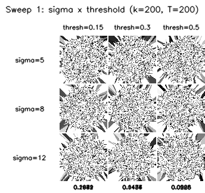
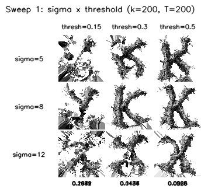
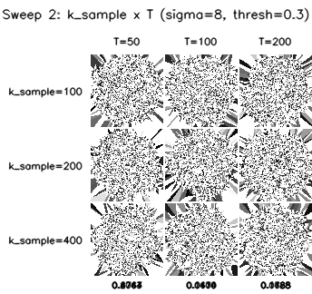
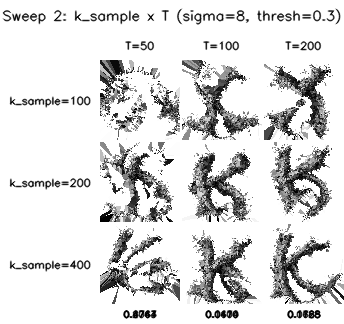

# ts-00009: Correlation-based Neighbor Sampling

**Date:** 2026-03-11
**Status:** Complete
**Source:** *tagged on completion as `exp/ts-00009`*

## Goal

Replace precomputed k-nearest neighbors (which assume known grid layout) with online correlation-based neighbor discovery. Each tick, sample random neurons, measure temporal correlation, and feed only the correlated pairs to the skip-gram learner.

## Motivation

Previous experiments used `topk_decay2d` — precomputed spatial neighbors from the known 2D grid. This is cheating: we already know the spatial layout and just ask the learner to rediscover it. In a real system (e.g. thalamic sorting), the spatial layout is unknown. The only signal available is temporal correlation between neurons.

This experiment asks: can the system discover spatial structure purely from observing which neurons fire together? No grid, no distances, no topology — just random probes of "is neuron A correlated with neuron B?"

## Approach

### Signal generation

We generate a buffer of T temporally independent, spatially correlated 2D fields. Each timestep is a Gaussian-smoothed random noise field applied to the grid. Spatial smoothing (controlled by `sigma`) creates the correlation structure — nearby pixels in the grid get similar values across time, distant pixels don't.

This models what a biological system might observe: neurons with nearby receptive fields fire together because they see similar stimuli.

### Correlation-based neighbor discovery (`tick_correlation`)

Each tick (implemented in `DriftSolver.tick_correlation()`):

1. Pick a batch of 256 random anchor neurons
2. For each anchor, sample `k_sample` random candidates from all n neurons
3. Compute Pearson correlation between anchor and each candidate using the signal buffer
4. Keep only candidates with |correlation| > `threshold`
5. Form variable-length sentences: `[anchor, good_neighbor_1, good_neighbor_2, ...]`
6. Extract all (center, context) pairs within a sliding window
7. Run standard skip-gram positive + negative sampling updates

The sentences are variable-length because each anchor finds a different number of correlated neighbors. A validity mask ensures padding positions don't generate training pairs.

### Key difference from sentence mode

In `tick_sentence` (experiment ts-00007), every neuron gets a sentence with exactly k neighbors — precomputed, guaranteed to be real spatial neighbors.

In `tick_correlation`, neighbors are discovered on-the-fly from signal statistics. Most random candidates are uncorrelated and get rejected. The sentences are sparse, noisy, and variable-length. The learner must extract structure from this weak, stochastic signal.

## New parameters

Three new parameters control the signal and the sampling:

**`--signal-T 200`** — How many timesteps in the signal buffer. Each timestep is one snapshot of spatially-correlated noise across all neurons. More timesteps = more reliable correlation estimates (like flipping a coin more times to estimate its bias). T=100 was too noisy, T=200 works.

**`--signal-sigma 8.0`** — Gaussian blur radius for generating signals. Controls how far spatial correlation reaches. sigma=3 means only immediate neighbors correlate. sigma=8 means neurons up to ~16 pixels apart have measurable correlation. This is critical — if sigma is too small, random sampling almost never hits a correlated neuron.

**`--k-sample 200`** — How many random candidates to check per anchor per tick. Out of 6400 neurons, we pick 200 at random and measure correlation with the anchor. More candidates = better chance of finding actual neighbors, but more compute. At k_sample=50, we rarely found anyone correlated. At 200, we reliably find 5-15 neighbors per anchor.

The existing **`--threshold`** parameter gets reused — it now means minimum |correlation| to accept a candidate as a neighbor (was previously used for similarity mode's attract/repel boundary).

### Parameter summary

| Parameter | Flag | Default | Role |
|-----------|------|---------|------|
| Signal length | `--signal-T` | 100 | Reliability of correlation estimates |
| Signal blur | `--signal-sigma` | 3.0 | Spatial reach of correlation |
| Candidates | `--k-sample` | 50 | Chance of finding real neighbors |
| Threshold | `--threshold` | 0.0 | Precision/recall of neighbor filter |
| Batch size | (hardcoded) | 256 | Anchors probed per tick |

### Interaction between parameters

The core trade-off: `sigma` and `threshold` together control signal-to-noise ratio.

- **sigma too small** (e.g. 3): correlation drops off sharply with distance. With k_sample=50 random candidates from 6400 neurons, almost none are close enough to correlate. Even threshold=0.2 finds only ~3 neighbors per anchor.
- **sigma too large**: everything correlates with everything. Sentences become non-informative ("all neurons are neighbors").
- **Sweet spot**: sigma=8 with threshold=0.3 — enough candidates pass to form meaningful sentences (~5-15 neighbors per anchor), but the threshold still selects for genuine spatial proximity.

## Results

### Test 1: sigma=3, threshold=0.5, k_sample=50 (FAILED)

```bash
python main.py word2vec --mode correlation -W 80 -H 80 --dims 8 \
    --k-neg 5 --lr 0.0005 --normalize-every 100 \
    --k-sample 50 --threshold 0.5 --signal-T 100 --signal-sigma 3.0 \
    -i K_80_g.png -f 1000 --save-every 10 -o output_9_run1 \
    --render umap --align
```

- 394k pairs trained, but disparity stuck at ~0.9999
- With sigma=3 and T=100, max |correlation| among 50 random candidates was only ~0.26
- Threshold 0.5 filtered out nearly everything — most sentences were length 1 (anchor only)

### Test 2: sigma=5, threshold=0.2, k_sample=200 (FAILED)

- 53M pairs trained, disparity ~0.997
- Lower threshold let more candidates through, but r=0.2 is barely above noise
- Sentences full of false positives — non-neighbors included, diluting the spatial signal

### Test 3: sigma=8, threshold=0.3, k_sample=200 (SUCCESS)

```bash
python main.py word2vec --mode correlation -W 80 -H 80 --dims 8 \
    --k-neg 5 --lr 0.001 --normalize-every 100 \
    --k-sample 200 --threshold 0.3 --signal-T 200 --signal-sigma 8.0 \
    -i K_80_g.png -f 5000 --save-every 50 -o output_9_run3 \
    --render umap --align
```

| Metric | Value |
|--------|-------|
| Total pairs | 304M |
| Final disparity | 0.08–0.09 |
| Training time | 131.9s |
| Ticks | 5000 |
| Frames | 101 |

K clearly visible and correctly oriented. Disparity converges smoothly from 1.0 to ~0.08.

**What changed:** sigma=8 creates broader spatial correlation (pixels up to ~16 apart have measurable correlation). T=200 gives more reliable correlation estimates. Threshold=0.3 filters noise while keeping genuine neighbors. Together, each anchor finds ~5-15 real neighbors per tick — enough to form informative sentences.

### Test 4: 160x160, sigma=8 (FAILED — sigma too small for grid size)

Same parameters as Test 3 but on 160x160 (25,600 neurons):

- 64M pairs trained, disparity stuck at ~0.998
- At 160x160, sigma=8 only correlates immediate neighbors. Sampling 200 out of 25,600 (0.8%) almost never hits them.
- Correlation stats: only 2 out of 200 candidates passed threshold=0.3

### Test 5: 160x160, sigma=16 (SUCCESS)

```bash
python main.py word2vec --mode correlation -W 160 -H 160 --dims 8 \
    --k-neg 5 --lr 0.001 --normalize-every 100 \
    --k-sample 200 --threshold 0.3 --signal-T 200 --signal-sigma 16.0 \
    -i K_160_g.png -f 5000 --save-every 50 -o output_9_run5_160 \
    --render umap --align
```

| Metric | Value |
|--------|-------|
| Total pairs | 279M |
| Final disparity | 0.15–0.17 |
| Training time | 430.7s |
| Ticks | 5000 |
| Neurons | 25,600 |

K clearly visible and still converging at 5k ticks. Higher disparity than 80x80 (0.17 vs 0.08) — 4x more neurons need more training to fully resolve fine structure.

### Scaling rule: sigma ≈ grid_size / 10

| Grid | Neurons | sigma | Candidates >0.3 (of 200) | Disparity at 5k ticks |
|------|---------|-------|--------------------------|----------------------|
| 80×80 | 6,400 | 8 | ~10–15 | 0.08 |
| 160×160 | 25,600 | 8 | ~2 (fails) | 0.998 |
| 160×160 | 25,600 | 16 | ~17 | 0.17 |

Sigma must scale with grid size to maintain a similar number of correlated candidates per random sample. Rule of thumb: sigma ≈ grid_size / 10 keeps ~10-17 neighbors passing threshold=0.3 with k_sample=200.

### Grid search: parameter sensitivity (80×80)

Ran 18 experiments in parallel (6 at a time, ~429s total) to map the parameter space.

**Sweep 1: sigma × threshold** (k_sample=200, T=200 fixed)

| | thresh=0.15 | thresh=0.3 | thresh=0.5 |
|----------|-------------|------------|------------|
| sigma=5  | 0.2671      | 0.1174     | 0.0568     |
| sigma=8  | 0.1949      | 0.0437     | **0.0225** |
| sigma=12 | 0.1682      | 0.1486     | 0.0926     |

Best: sigma=8, threshold=0.5 → **0.0225**. Higher threshold consistently wins across all sigma values — precision matters more than recall. sigma=8 is the sweet spot; sigma=12 is worse despite broader correlation, likely because too many distant neurons pass the filter.

Start (random embeddings):



Final (5000 ticks):



**Sweep 2: k_sample × signal_T** (sigma=8, threshold=0.3 fixed)

| | T=50 | T=100 | T=200 |
|--------------|--------|--------|--------|
| k_sample=100 | 0.6063 | 0.1110 | 0.1628 |
| k_sample=200 | 0.2764 | **0.0404** | 0.1185 |
| k_sample=400 | 0.4747 | 0.0670 | 0.0768 |

Best: k_sample=200, T=100 → **0.0404**. T=50 is consistently bad (unreliable correlation estimates). Surprisingly, T=100 beats T=200 — longer buffers may oversmooth transient correlation structure. k_sample=200 is the sweet spot; k_sample=400 doesn't help much and adds compute.

Start (random embeddings):



Final (5000 ticks):



**Key findings:**
- Threshold is the single most impactful parameter — higher is better (0.5 > 0.3 > 0.15)
- sigma=8 is optimal for 80×80 — too small misses neighbors, too large includes non-neighbors
- T=100 is sufficient and slightly better than T=200
- k_sample=200 is the sweet spot — 100 misses too many, 400 adds little value
- Best overall config: sigma=8, threshold=0.5, k_sample=200, T=100–200 → disparity 0.02–0.04

```bash
# Grid search command
python run_correlation_grid.py -i K_80_g.png -o output_9_grid -j 6
```

### Test 6: Anchor-only pairs vs sliding window

Tested whether restricting training to only verified (anchor, neighbor) pairs — no transitive neighbor-to-neighbor pairs from the sliding window — would improve quality.

**Hypothesis:** The sliding window generates unverified pairs (neighbor B paired with neighbor C, where both correlate with anchor A but not necessarily with each other). Removing these noisy pairs should improve precision.

**Result:** Precision helps, but data volume matters more.

| Approach | Ticks | Pairs | Final disparity |
|----------|-------|-------|-----------------|
| Sliding window | 5k | 171M | **0.0225** |
| Anchor-only | 5k | 19M | 0.989 |
| Anchor-only | 50k | 191M | 0.0955 |

At 5k ticks, anchor-only generates ~10x fewer pairs and doesn't converge at all. At 50k ticks (~equal pair count), sliding window still wins by ~4x on disparity. The transitive pairs from the sliding window are a form of implicit inference — if A correlates with both B and C, B and C are likely spatially close too. The learner benefits from this signal more than it's hurt by the noise.

**Conclusion:** Sliding window is default. `--anchor-only` flag available for comparison.

## Thoughts

### It works — spatial maps from correlation alone

The skip-gram learner can recover the full 2D spatial structure purely from stochastic correlation probes. No precomputed neighbors, no known grid, no topology information. Just "pick random neuron, check some others, learn from the correlated ones."

This is the core biological claim: if neurons that are spatially close tend to fire together (because they share receptive field overlap), then a Hebbian learning rule applied to random samples of co-activity can discover the spatial map.

### The signal matters more than the learner

Tests 1-2 vs Test 3 show that the bottleneck wasn't the learner — it was whether the correlation signal was strong enough to identify real neighbors. The skip-gram learner is very tolerant of noise (it's designed for noisy co-occurrence counts in NLP). The critical parameters are sigma (correlation radius), T (estimation reliability), and threshold (signal-to-noise filter).

### Threshold is a precision/recall knob — and precision wins

- High threshold: fewer neighbors, higher precision (real neighbors only), but slower learning
- Low threshold: more neighbors, lower precision (false positives), but noisier gradients
- Grid search settled it: higher threshold is strictly better. 0.5 > 0.3 > 0.15 across all sigma values. The skip-gram learner handles sparse data well but is sensitive to false positives. Better to find 5 real neighbors than 15 noisy ones.

### Scaling

At 80x80 (6400 neurons), k_sample=200 checks 3% of all neurons. At 160x160 (25,600), it's only 0.8%. The approach still works without increasing k_sample — the key is scaling sigma with grid size so that enough of the random candidates fall within the correlation radius. More ticks are needed at larger scales (4x neurons → disparity 0.17 vs 0.08 at same tick count).

### Possible extensions

- **Online signal buffer**: Replace static pre-generated signals with a rolling buffer that gets new frames over time. More biologically plausible — the system learns from ongoing sensory input, not a fixed dataset.
- **Adaptive threshold**: Start with low threshold (explore broadly), increase as embeddings improve (exploit known neighborhoods).
- **Use embeddings as signal source**: Once embeddings partially converge, use embedding similarity to guide which candidates to probe — a bootstrap effect where the map helps discover its own neighbors.

## Files

- `main.py` — `correlation` mode in `run_word2vec()`
- `solvers/drift_torch.py` — `tick_correlation()` method in `DriftSolver`
- `run_correlation_grid.py` — Parallel grid search over correlation parameters
- `output_9_run*` — Output frames and logs
- `output_9_grid_*` — Grid search output directories
