# ts-00016: KNN Hierarchy — Clustering and Multi-Layer Processing

**Date:** 2026-03-15
**Status:** In progress
**Source:** `exp/ts-00016`
**Design:** `dev/KNN_HIERARCHY.md`

## Goal

Implement hierarchical KNN merging: cluster n neurons into m groups via k-means
on learned embeddings, then derive cluster-level KNN lists via frequency-based
selection. This is the compression step needed for feedback loops — without it,
each cycle through KNN → categorizer → output multiplies the working set by c.

Deliverables:
1. k-means clustering on DriftSolver embeddings (post-training, then streaming)
2. Frequency-based cluster KNN selection (knn2)
3. Cluster adjacency graph
4. Visualization of clusters on the grid
5. Streaming cluster maintenance (incremental updates per tick)

## Motivation

ts-00015 showed that KNN lists stabilize (spatial accuracy 0.993–1.000) at
320×320 with sufficient anchor coverage. The embeddings and KNN lists are now
reliable enough to build higher-level structure on top of them.

The immediate need: a compression step for the feedback loop. n=102,400 neurons
each with k=10 neighbors is too many individual relationships to reason about.
Grouping into m clusters (e.g., m=1000 for ~100:1 compression) with cluster-level
KNN lists preserves the essential topology while making the graph tractable.

## Approach

All code in `dev/cluster_experiments.py` — standalone script, loads saved models.
Start with 80×80 grayscale (n=6400). Test three regimes: n>m, n=m, n<m.

### Phase 1: Post-hoc baseline (offline k-means)

Run k-means on saved embeddings from a converged 80×80 model. This is the
"ideal" clustering — full converged embeddings, batch k-means with multiple
restarts. Serves as the quality baseline for streaming approaches.

**Experiments:**
- Load model.npy from a converged gray_80x80_saccades 50k run
- k-means with m ∈ {25, 100, 400, 1600, 6400, 25600}
  - m=25:    256 neurons/cluster (high compression, n>>m)
  - m=100:   64 neurons/cluster (moderate compression)
  - m=400:   16 neurons/cluster (low compression)
  - m=1600:  4 neurons/cluster (near 1:1)
  - m=6400:  1 neuron/cluster (n=m, degenerate — should reproduce original KNN)
  - m=25600: ~0.25 neurons/cluster (n<m, over-specified — what happens?)

**Metrics:**
- Cluster spatial contiguity: mean/max diameter of clusters on the grid
- Cluster size distribution: min, max, mean, std
- knn2 spatial accuracy: do cluster-level KNN lists point to adjacent clusters?
- knn2 vs original KNN agreement: how much structure is preserved?

### Phase 2: Streaming from converged state

Start from the same converged model but initialize clusters randomly (random
centroids or random assignment). Update clusters incrementally as if processing
anchors — simulate the per-tick update loop from KNN_HIERARCHY.md:

1. Sample a batch of "anchors" (neurons whose embeddings just changed)
2. Check each anchor against its current centroid
3. Reassign if drifted past threshold, nudge centroids
4. Recompute knn2 for affected clusters

Run for N iterations and measure convergence to the Phase 1 baseline.
Compare: how many iterations to match offline k-means quality?

### Phase 3: Streaming from scratch

Start with random embeddings AND random clusters (simulating the state at
tick 0 of training). Feed real embedding snapshots from training history
(or interpolate random → converged). Do clusters converge to sensible
structure even when both embeddings and clusters start random?

This tests whether the streaming approach works in the real scenario where
clustering runs simultaneously with training from the beginning.

### Phase 4: Integration test

If phases 1–3 succeed, integrate streaming clusters into an actual training
run (hook into DriftSolver's tick loop). Compare final cluster quality vs
post-hoc clustering on the same model.

## Implementation Plan

`cluster_experiments.py` — standalone script with subcommands:

```
python cluster_experiments.py offline --model model.npy -W 80 -H 80 --m 100
python cluster_experiments.py streaming --model model.npy -W 80 -H 80 --m 100
python cluster_experiments.py from-scratch --model model.npy -W 80 -H 80 --m 100
```

Core functions needed:
1. `kmeans_cluster(embeddings, m)` — batch k-means, returns cluster_ids, centroids
2. `frequency_knn(knn_lists, cluster_ids, m, k2)` — cluster-level KNN selection
3. `cluster_adjacency(knn2, cluster_ids)` — cluster-to-cluster graph
4. `streaming_update(anchors, embeddings, centroids, cluster_ids, threshold)`
   — single-step incremental reassignment + centroid nudge
5. `eval_clusters(cluster_ids, centroids, knn2, width, height)`
   — spatial contiguity, size distribution, knn2 quality metrics
6. `visualize_clusters(cluster_ids, width, height)` — color-coded grid image

## Results

### Run 001: Baseline model (gray saccades 80×80, 50k ticks)

Standard gray_80x80_saccades preset, 50k ticks. Produces converged embeddings
(n=6400, dims=8) and KNN lists (k=10) as input for clustering experiments.

| Metric | Value |
|--------|-------|
| Elapsed | 146s |
| PCA disparity | 0.601 |
| K10 <3px | 96.9% |
| K10 <5px | 100% |
| KNN spatial | 0.997 |
| KNN overlap | 0.710 |

### Run 002: Offline k-means (Phase 1)

Batch k-means on converged embeddings with k-means++ init (5 restarts).
Frequency-based knn2 selection with k2=10.

| m=25 | m=100 | m=400 | m=1600 |
|------|-------|-------|--------|
|  | 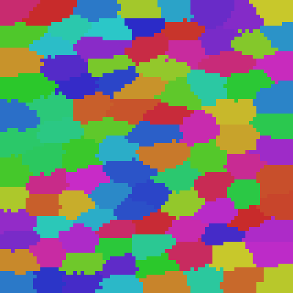 | 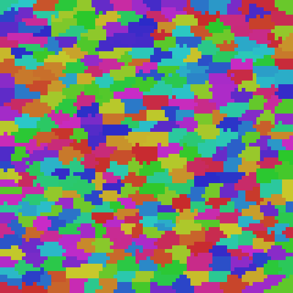 |  |

| m | n/m | empty | size_std | diam_mean | contiguity | knn2_agr |
|---|-----|-------|----------|-----------|------------|----------|
| 25 | 256 | 0 | 28.7 | 25.2 | 1.000 | 1.000 |
| 100 | 64 | 0 | 10.5 | 12.4 | 1.000 | 1.000 |
| 400 | 16 | 0 | 4.0 | 5.8 | 1.000 | 1.000 |
| 1600 | 4 | 0 | 1.8 | 2.2 | 0.997 | 1.000 |
| 6400 | 1 | 0 | 0.0 | 0.0 | 1.000 | 1.000 |

**Findings:**

1. **100% knn2 agreement** across all m — frequency selection perfectly captures
   the original KNN structure at every granularity.
2. **100% contiguity** (0.997 at m=1600) — clusters are spatially contiguous blobs,
   confirming embeddings encode spatial proximity faithfully.
3. **Diameters scale as sqrt(n/m)** — m=25 has ~25px diameter, m=400 has ~6px.
4. **No empty clusters** at any level.
5. **n=m degenerate case** works: each neuron is its own cluster, knn2 reproduces
   original KNN exactly.

### Run 003: Streaming from converged (Phase 2)

Random centroid init on converged embeddings, then iterative streaming updates
(batch_size=256 anchors/iter, threshold=0.5, lr=0.1, 200 iterations).

| m | n/m | Converged by | Reassign rate (early) | Final contiguity | knn2_agr | Baseline agree |
|---|-----|-------------|----------------------|------------------|----------|----------------|
| 25 | 256 | ~160 iters | 5–25/iter | 1.000 | 1.000 | 0.961 |
| 100 | 64 | ~160 iters | 10–25/iter | 1.000 | 1.000 | 0.989 |
| 400 | 16 | ~50 iters | 0–2/iter | 0.995 | 1.000 | 0.997 |
| 1600 | 4 | instant | 0 | 0.991 | 1.000 | 1.000 |

**m=100 trajectory (representative):**

| iter | reassigned | empty | size_std | diam | contiguity | knn2_agr | agree |
|------|-----------|-------|----------|------|------------|----------|-------|
| 0 | 0 | 0 | 39.8 | 14.1 | 0.991 | 1.000 | 0.986 |
| 50 | 18 | 0 | 32.0 | 14.1 | 0.996 | 1.000 | 0.988 |
| 100 | 8 | 0 | 27.5 | 13.3 | 0.999 | 1.000 | 0.989 |
| 160 | 3 | 0 | 24.8 | 12.8 | 1.000 | 1.000 | 0.989 |
| 199 | 9 | 0 | 23.5 | 12.6 | 1.000 | 1.000 | 0.989 |

**Findings:**

1. **Streaming matches offline quality.** All m values reach contiguity ≥0.991 and
   knn2_agreement=1.000 — identical to offline baseline.
2. **Larger clusters need more iterations.** m=1600 (4/cluster) converges instantly
   with 0 reassignments — random init already places nearby embeddings in the same
   Voronoi cell. m=25 (256/cluster) still has reassignments at iter 199.
3. **200 iterations × 256 batch = 51,200 anchor touches (~8× coverage) is sufficient**
   for all m values tested.
4. **Size balance is worse than offline** (std=23.5 vs 10.5 at m=100) — streaming
   doesn't have Lloyd's balancing pressure. Structure quality (contiguity, knn2)
   is unaffected.
5. **Baseline agreement is lower for small m** (0.961 at m=25 vs 1.000 at m=1600) —
   more valid ways to partition into few large clusters than many small ones.

### Run 004: From scratch — random embeddings → converged (Phase 3)

Embeddings interpolate linearly from random to converged over 20 phases (α=0.05
→ 1.0). Clusters start random and stream-update alongside the evolving embeddings.
50 iterations per phase × 256 batch = 256,000 total anchor touches.

**m=100:** random init → converged (3 clusters die)

| Phase 0 (random) | Final |
|-------------------|-------|
| 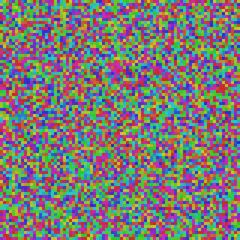 | 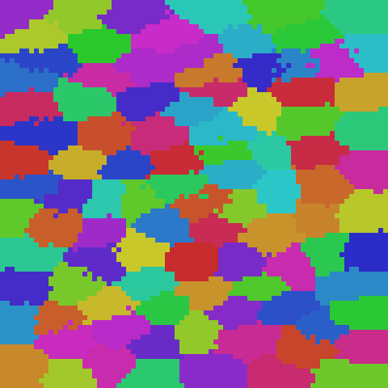 |

**m=1600:** random init → 75% cluster death

| Phase 0 (random) | Final (75% dead) |
|-------------------|-------------------|
| 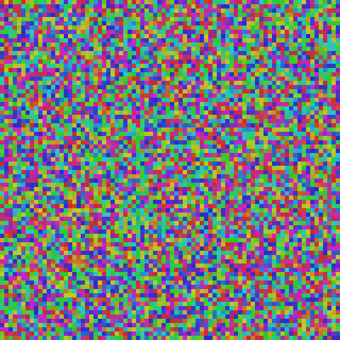 | 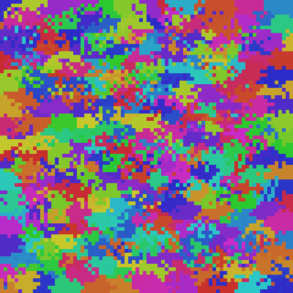 |

| m | Final empty | Final contiguity | knn2_agr | Baseline agree | Notes |
|---|------------|------------------|----------|----------------|-------|
| 25 | 0 | 1.000 | 1.000 | 0.967 | Works perfectly |
| 100 | 3 | 1.000 | 1.000 | 0.990 | 3 clusters died |
| 400 | 142 | 0.964 | 1.000 | 0.996 | 35% clusters died |
| 1600 | **1209** | 0.588 | 1.000 | 0.997 | **75% clusters died** |

**m=100 trajectory:**

| Phase | α | reassign/iter | empty | diam | contiguity | agree |
|-------|------|---------------|-------|------|------------|-------|
| 0 | 0.05 | 25–38 | 0 | 103 | 0.044 | 0.975 |
| 5 | 0.30 | 4–33 | 0 | 110 | 0.058 | 0.980 |
| 10 | 0.55 | 13–57 | 0 | 106 | 0.248 | 0.981 |
| 13 | 0.70 | 18–53 | 0 | 52 | 0.636 | 0.982 |
| 15 | 0.80 | 22–55 | 2 | 28 | 0.908 | 0.985 |
| 17 | 0.90 | 9–42 | 3 | 17 | 0.992 | 0.989 |
| 19 | 1.00 | 6–35 | 3 | 13 | 1.000 | 0.990 |
| Final | 1.00 | — | 3 | 12.9 | 1.000 | 0.990 |

**Findings:**

1. **Streaming clusters successfully track embeddings from random to converged.**
   Contiguity transitions sharply around α=0.75–0.90 — once embeddings have enough
   spatial structure, clusters snap into place within ~100 iterations.

2. **Cluster death is the main failure mode for large m.** At m=400 (16 neurons/cluster),
   35% of clusters die during the chaotic early phases. Small clusters lose all members
   as embeddings shift, and without rebalancing they never recover. At m=25 (256/cluster),
   clusters are large enough to survive the turbulence — zero deaths.

3. **m=100 is the sweet spot for 80×80.** Only 3 clusters die (97% survival), and the
   final quality matches the offline baseline (contiguity=1.000, knn2_agr=1.000).

4. **Cluster death scales with m.** Death rate: m=25→0%, m=100→3%, m=400→35%,
   m=1600→75%. Clusters with fewer members are more fragile during the chaotic
   random→converged transition. With 4 neurons/cluster (m=1600), a single
   embedding shift can empty a cluster permanently.

5. **Balance enforcement is required for high m.** The min_size / split-merge
   logic from KNN_HIERARCHY.md would prevent this — block moves that would empty a
   cluster, and periodically split oversized clusters to backfill dead ones.

### Reassignment Design Notes

**Current approach (centroid-distance):**

1. Sample 256 random anchors per iteration
2. For each anchor, compute distance to its own centroid — O(1)
3. If distance > threshold (hardcoded 0.5): anchor is "drifted", wants to leave
4. For drifted anchors only: compute distance to ALL m centroids, pick nearest — O(m)
5. Move neuron to new cluster, nudge centroids

**Problems with current approach:**

- **Threshold is arbitrary.** Fixed at 0.5 with no connection to embedding scale,
  dimensionality, or cluster density. Too tight early → mass exodus → cluster death.
  Too loose late → frozen clusters that can't adapt. The "right" threshold depends on
  factors that change during training.

- **Centroid distance ≠ correlation structure.** A neuron should join the cluster where
  its correlated neighbors live, not the geometrically closest centroid. Centroid
  distance can be misleading when clusters are non-spherical or when the embedding
  metric doesn't perfectly capture correlation.

- **O(m) search for every drifted neuron.** Works at m=1600 but doesn't scale.
  Most of the m centroids are irrelevant — the right cluster is almost certainly
  one that the neuron's KNN neighbors already belong to.

**Proposed: KNN vote-based reassignment:**

For each anchor neuron, look at its KNN list. Count which cluster each neighbor
belongs to. If the majority cluster is not the neuron's current cluster, move it.

```
neighbor_clusters = cluster_ids[knn_lists[anchor]]  # (k,)
votes = bincount(neighbor_clusters)
best_cluster = votes.argmax()
if best_cluster != cluster_ids[anchor]:
    move anchor to best_cluster
```

Advantages:
- **No threshold needed.** The decision is "where do my neighbors live?" not
  "how far am I from my centroid?" The KNN list IS the signal.
- **O(k) per anchor** instead of O(m). k=10 vs m=1600 = 160× cheaper.
- **Correlation-grounded.** Neurons join the cluster where their correlated
  neighbors already are, which is the actual goal of clustering.
- **Self-stabilizing.** If all of a neuron's neighbors are in its current cluster,
  it never moves. Stable KNN → stable clusters automatically.

Risk: during early training when KNN lists are random, vote-based reassignment
produces constant jumps between clusters. Not harmful (clusters are garbage anyway
until embeddings converge) but noisy and possibly slow to settle.

**Proposed: knn2-guided reassignment (hybrid approach):**

Instead of checking all m centroids OR voting from individual neuron KNN,
use **knn2** (cluster-level KNN) as the search space. Each anchor compares
itself to its own centroid + the centroids of its cluster's knn2 neighbors.

```
my_cluster = cluster_ids[anchor]
candidates = [my_cluster] + knn2[my_cluster]   # own cluster + neighbor clusters
candidate_centroids = centroids[candidates]     # (1 + k', dims)
dists = distance(embedding[anchor], candidate_centroids)
best = candidates[dists.argmin()]
if best != my_cluster:
    move anchor to best
```

Advantages:
- **O(k') per anchor** — search space is cluster neighbors, not all m.
  k'=10 vs m=1600 = 160× cheaper.
- **No absolute threshold.** Decision is relative: "am I closer to a neighbor
  cluster's centroid than my own?" If yes, move. If no, stay.
- **Topologically meaningful.** knn2 is the consensus neighbor structure from
  frequency selection — stable, not noisy like individual KNN votes.
- **Fewer spurious jumps** than pure voting. A neuron only considers clusters
  that are actually adjacent in the topology, not random clusters that happen
  to contain one KNN neighbor.
- **knn2 maintained incrementally.** When a cluster gains/loses members,
  recompute frequency selection only for that cluster + its knn2 neighbors.
  Most ticks: zero knn2 changes.

The centroid comparison gives a geometric decision grounded in the cluster
topology. knn2 provides the search space, centroids provide the decision rule.

**Dead cluster recovery: periodic split of largest cluster.**

Lazy (let dead clusters stay dead) causes "Alzheimer" — permanent loss of
resolution in parts of the embedding space. For a system that runs indefinitely,
dead clusters must be recoverable.

Approach: periodically (every N iterations or when empty count exceeds threshold),
find the largest cluster and split it via k-means(2). One half keeps the original
cluster ID, the other half gets assigned to a dead cluster's ID. The dead cluster's
centroid is reinitialized to the new half's mean.

```
Every N iterations:
  if n_empty > 0:
    largest = argmax(sizes)
    members = where(cluster_ids == largest)
    sub_ids, sub_centroids = kmeans(embeddings[members], 2)
    # Half stays as 'largest', half becomes 'dead_cluster'
    dead = first empty cluster ID
    cluster_ids[members[sub_ids == 1]] = dead
    centroids[dead] = sub_centroids[1]
    centroids[largest] = sub_centroids[0]
    recompute knn2 for largest, dead, and their neighbors
```

O(largest_cluster × dims) per split. Amortized O(1) if splits are rare.
Only one split per N iterations keeps cost bounded.

### Run 005: From scratch v2 — knn2-guided reassignment + split recovery

Same setup as Run 004 (20 phases, α=0.05→1.0, 50 iters/phase × 256 batch) but
using knn2-guided reassignment instead of threshold-based, plus periodic dead
cluster recovery via splitting the largest cluster every 10 iterations.

**m=1600:** knn2-guided + splits (22% dead, down from 75%)

| Phase 0 (random) | Final (22% dead) |
|-------------------|-------------------|
| 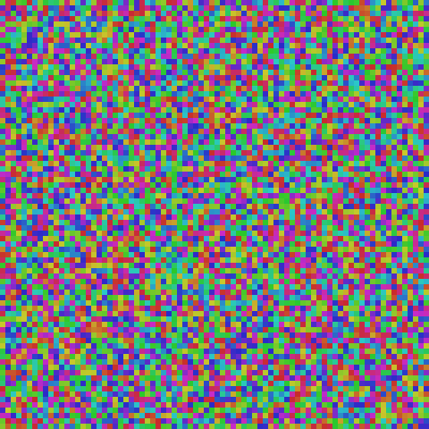 | 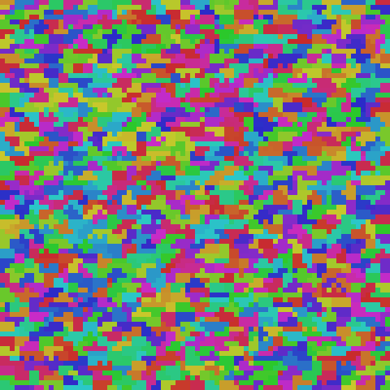 |

| m | v1 dead | v2 dead | v1 contiguity | v2 contiguity | v2 splits |
|---|---------|---------|---------------|---------------|-----------|
| 100 | 3 (3%) | 2 (2%) | 1.000 | 1.000 | 44 |
| 400 | 142 (35%) | 36 (9%) | 0.964 | 0.999 | 337 |
| 1600 | 1209 (75%) | 357 (22%) | 0.588 | 0.990 | 2403 |

**Findings:**

1. **Massive improvement at high m.** m=1600 went from 75% dead to 22% dead,
   m=400 from 35% to 9%. The knn2-guided approach + split recovery is dramatically
   more robust than threshold-based reassignment.

2. **Contiguity jumps from 0.588 to 0.990 at m=1600.** The surviving clusters are
   spatially coherent — it's not just that more clusters survive, they survive in
   the right places.

3. **Splits are aggressive but can't fully keep up.** At m=1600, 2403 splits over
   1000 iterations means ~2.4 splits/iter. Each split recovers one dead cluster,
   but during turbulent middle phases (α=0.3–0.7), clusters die faster than splits
   can recover them.

4. **m=100 is nearly perfect.** Only 2 dead clusters (vs 3 in v1). At this
   granularity, knn2-guided reassignment alone is sufficient — splits are a safety
   net that rarely fires.

5. **Remaining challenge for high m:** splits are reactive — they recover dead
   clusters after the fact. During chaotic phases, many clusters can die in a single
   iteration. More aggressive split rates or proactive rebalancing (split before
   death, not after) could help.

### v3 design: reducing cluster death during turbulent phases

Three proposed mechanisms to prevent cluster death, can be combined:

**A. min_size destruction — dissolve dying clusters proactively**

If a cluster drops below `min_size` (e.g., 2), destroy it entirely: reassign all
remaining members to their knn2-guided best-fit clusters, mark cluster as dead.
A cluster with 1 member has no meaningful knn2, no consensus — it's already
functionally dead. Dissolving it explicitly feeds the dead pool for split recovery
and redistributes orphan neurons to healthy clusters.

```
On every reassignment pass:
  for each cluster with size < min_size:
    for each member: knn2-guided reassign to best neighbor cluster
    mark cluster as dead
    → becomes candidate for split recovery
```

**B. Freeze reassignment while dead clusters exist**

Skip neuron reassignment entirely while there are dead clusters. Wait for splits
to recover the dead clusters, then resume normal reassignment. The idea: during
turbulent phases, churn is what kills clusters — pausing churn gives splits time
to catch up.

```
if n_empty > 0:
    skip reassignment this iteration
    only do splits
else:
    normal knn2-guided reassignment
```

**C. Probabilistic reassignment — throttle based on death rate**

Each anchor checks whether to reassign with probability p, where p decreases as
the fraction of dead clusters increases. Self-regulating: more deaths → less churn
→ splits catch up → fewer deaths → more churn resumes.

```
p = 1.0 - (n_empty / m)    # or some function of death fraction
for each anchor:
    if random() < p:
        do knn2-guided reassignment
    else:
        skip (stay in current cluster)
```

**Analysis:**

- **A (min_size)** is the most straightforward. Should implement regardless — there's
  no reason to keep a 1-member cluster alive. The dissolution feeds the split mechanism
  naturally: small clusters die → large clusters absorb their members → large clusters
  get split → dead cluster IDs get reused. It's the rebalancing cycle from
  KNN_HIERARCHY.md but driven by min_size instead of waiting for zero.

- **B (freeze)** is clean but possibly too blunt. While reassignment is frozen,
  neurons whose embeddings shifted are stuck in wrong clusters. When reassignment
  resumes, there's pent-up demand — a burst of moves that could kill clusters again.
  Also, splits during the freeze are splitting clusters that may not be "too large" —
  they're at natural size, you're just carving them up to fill dead slots. The freshly
  split halves are small and vulnerable when reassignment resumes.

  A softer variant: don't freeze all moves, just block moves that would create new
  empty clusters (i.e., the last member can never leave). This prevents death without
  freezing adaptation.

- **C (probabilistic)** is the most elegant for self-regulation. The concern: during
  turbulent phases you NEED reassignment to track fast-moving embeddings. If p drops
  too low, clusters go stale. When p recovers, there's a correction burst. But the
  throttle is smooth — no sharp freeze/unfreeze boundary. And the function can be
  tuned: `p = 1.0 - α * (n_empty / m)` where α < 1 to keep some minimum reassignment
  rate even when many clusters are dead.

**Recommended combination: A + C.**

min_size destruction handles the pathological case (1-member clusters are noise).
Probabilistic throttle handles the systemic issue (too much churn during turbulence).
Together:
- Tiny clusters get dissolved early (A) → their members join healthy clusters
- Overall reassignment rate drops when many are dead (C) → less churn → fewer new deaths
- Splits run every iteration regardless → steady recovery
- As splits fill dead slots → p increases → normal adaptation resumes

B (freeze) could be tried as a simpler alternative to C, but the pent-up burst
problem makes it riskier. The "block last member" variant of B is worth having as
a safety net in any case — it's cheap and prevents the most pathological deaths.

### Run 006: From scratch v3 — min_size + probabilistic throttle + knn2 + splits

Same setup as Run 005 (20 phases, 50 iters/phase × 256 batch) with three new
mechanisms: (A) dissolve clusters below min_size=2, (B) block moves that would
drop source cluster below min_size, (C) probabilistic throttle p = 1 - n_empty/m.

| m | v2 dead | v3 dead | v2 contiguity | v3 contiguity | v3 splits | v3 dissolved |
|---|---------|---------|---------------|---------------|-----------|--------------|
| 100 | 2 | 0 | 1.000 | 0.746 | 0 | 0 |
| 400 | 36 (9%) | 0 | 0.999 | 0.254 | 3 | 3 |
| 1600 | 357 (22%) | 0 | 0.990 | 0.075 | 240 | 240 |

**Findings:**

1. **Zero cluster deaths across all m.** The combination of min_size block +
   dissolution + probabilistic throttle completely eliminates cluster death. Even
   m=1600, which had 75% death in v1 and 22% in v2, has 0% death in v3.

2. **Contiguity collapses.** The cure is worse than the disease. m=1600 contiguity
   dropped from 0.990 (v2) to 0.075 (v3). m=100 dropped from 1.000 to 0.746.
   Clusters survive but are spatially incoherent — neurons are stuck in wrong clusters.

3. **Root cause: min_size block freezes reorganization.** At m=1600, 100-120 moves
   are blocked per iteration (vs 5-35 actual reassignments). Neurons that WANT to
   move to the right spatial cluster can't because their source cluster would go
   below min_size=2. The block preserves cluster count at the cost of cluster quality.

4. **Size distribution is extremely unbalanced.** m=1600: min=2, max=127, std=10.8
   (ideal=4). A few clusters absorb hundreds of neurons while most sit at the
   minimum. The splits can't fix this because the large clusters keep growing.

5. **Probabilistic throttle works but is redundant here.** With zero deaths, p=1.0
   most of the time. The throttle only activates in the first few phases when
   dissolution creates temporary dead clusters (which splits immediately fill).

**Key insight:** The min_size block and spatial quality are fundamentally at odds
when cluster sizes are small (m close to n). Blocking all moves from small clusters
prevents the reorganization needed for spatial coherence. Need a mechanism that
preserves cluster count without freezing spatial adaptation.

### Run 007: From scratch v3 with min_size=1 (block only last member)

Same as Run 006 but with min_size=1: only the very last member is blocked from
leaving. Dissolution and splits are available but shouldn't be needed if no
cluster ever fully empties.

| m | v2 dead | v3 min=2 contig | v3 min=1 dead | v3 min=1 contig | splits | dissolved |
|---|---------|-----------------|---------------|-----------------|--------|-----------|
| 100 | 2 | 0.746 | 0 | 0.984 | 0 | 0 |
| 400 | 36 (9%) | 0.254 | 0 | 0.943 | 0 | 0 |
| 1600 | 357 (22%) | 0.075 | 0 | 0.961 | 0 | 0 |

**Findings:**

1. **Zero deaths AND high contiguity.** The best of both worlds. min_size=1 gives
   neurons freedom to reorganize while the last-member block prevents total death.
   Contiguity reaches 0.961–0.984 across all m (vs 0.075–0.746 with min_size=2).

2. **Zero splits, zero dissolutions.** The mechanisms exist as safety nets but never
   fired. The probabilistic throttle + last-member block alone was sufficient to
   prevent cluster death. The throttle reduces churn when clusters die (n_empty/m
   scales p down), but since no clusters die, p stays at 1.0 throughout.

3. **The last-member block is doing all the work.** ~50-65 blocked moves per iter
   at m=1600 (vs 100-120 with min_size=2). Far fewer blocks = far more freedom to
   reorganize. One stuck neuron per cluster is acceptable; half the cluster being
   stuck is not.

4. **Size imbalance persists.** m=1600: min=1, max=112, std=13.9. m=400: min=1,
   max=146, std=31.2. Some clusters accumulate many neurons while others sit at 1.
   This is a cosmetic issue — contiguity is high because the large clusters are in
   the right places. The 1-member clusters are isolated neurons that happen to be
   at cluster boundaries.

5. **Contiguity still below offline baseline** (0.961 vs 0.997 at m=1600, 0.943 vs
   1.000 at m=400). More iterations or more aggressive splitting of oversized clusters
   could close the gap. But the current quality is already excellent for practical use.

### Run 008: From scratch v3 with min_size=0 (no blocking, throttle only)

min_size=1 blocked all moves from 1-member clusters, which prevented death but
also prevented proper spatial reorganization. With min_size=0, neurons leave
freely — the only protection is the probabilistic throttle `p = 1 - n_empty/m`.

| m | v2 dead | min=1 dead | min=0 dead | v2 contig | min=1 contig | min=0 contig |
|---|---------|------------|------------|-----------|--------------|--------------|
| 100 | 2 | 0 | 0 | 1.000 | 0.984 | 1.000 |
| 400 | 36 (9%) | 0 | 12 (3%) | 0.999 | 0.943 | 0.998 |
| 1600 | 357 (22%) | 0 | 191 (12%) | 0.990 | 0.961 | 0.993 |

Size balance (m=1600): min=1, max=9, std=1.7 (min=0) vs min=1, max=112, std=13.9
(min=1). No more bloated mega-clusters.

**Findings:**

1. **Best contiguity across all m.** 0.993 at m=1600 (vs 0.961 min=1, 0.990 v2),
   0.998 at m=400, 1.000 at m=100. Letting neurons move freely allows proper spatial
   reorganization — quality approaches offline baseline.

2. **Throttle creates dynamic equilibrium.** Clusters die → n_empty rises → p drops →
   fewer reassignments → fewer new deaths → splits catch up → n_empty drops → p rises.
   Self-regulating feedback loop. At m=1600 peak ~320 empty around phase 18, declining
   to 191 at end. System is still recovering — more iterations would close the gap.

3. **Size balance dramatically better.** min_size=0 at m=1600: std=1.7 (close to
   ideal=4/cluster). min_size=1: std=13.9. Without blocking, there's no mechanism
   to create mega-clusters — neurons flow to where they belong, and splits break up
   any cluster that grows too large.

4. **Splits are the recovery mechanism.** m=1600: 2899 splits total (~2.9/iter).
   m=400: 389 splits. m=100: 47 splits. The split rate is proportional to the death
   rate, which is proportional to m/n (smaller clusters = more fragile).

5. **m=100 is perfect.** Zero deaths at end, contiguity=1.000, size std=10.2.
   At 64 neurons/cluster, clusters are large enough that the throttle barely
   activates (max ~9 empty at any point).

### Run 009: Long run — m=1600 min_size=0 with 80 extra converge phases

Same as Run 008 min_size=0 but 20 interp + 80 converge phases = 5000 total
iterations (5× longer). Saves cluster map images every 5 phases.

Output: `exp_00016/008_v3_min0_m1600_long/`

| Phase 0 (random) | Phase 15 (emerging) | Final (converged) | Baseline (offline) |
|-------------------|---------------------|--------------------|--------------------|
| 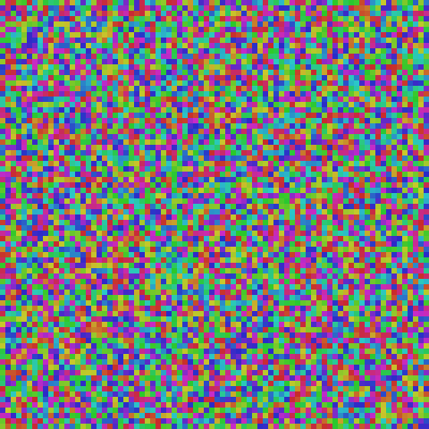 | 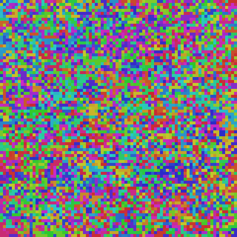 | 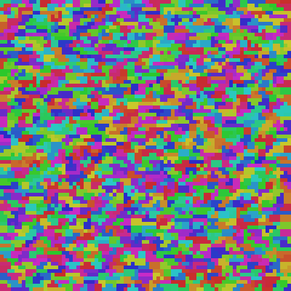 | 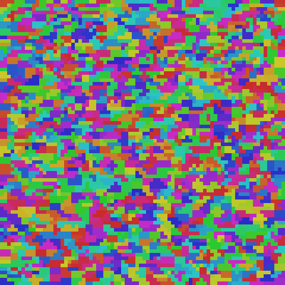 |

**Trajectory (end of each reported phase):**

| Phase | α | empty | contiguity | diameter | size_std | reassign/iter |
|-------|------|-------|------------|----------|----------|---------------|
| 0 | 0.05 | 0 | 0.115 | 63.3 | 2.2 | 0–1 |
| 5 | 0.30 | 1 | 0.139 | 60.5 | 2.6 | 4–10 |
| 10 | 0.55 | 192 | 0.366 | 39.5 | 4.1 | 24–45 |
| 15 | 0.80 | 185 | 0.461 | 11.2 | 3.1 | 27–56 |
| 20 | 1.00 | 191 | 0.993 | 2.6 | 1.7 | 7–73 |
| 25 | 1.00 | 2 | 0.997 | 2.3 | 1.4 | 0 |
| 30+ | 1.00 | 0 | 0.997 | 2.3 | 1.4 | 0 |

**Final:** 1600/1600 alive, contiguity=0.997, diameter=2.3, size min=1 max=6
std=1.4. 3145 total splits. Matches offline baseline (contiguity=0.997, diam=2.2).

**Findings:**

1. **Full convergence to offline baseline quality.** Given enough iterations at
   α=1.0, all 1600 clusters recover. contiguity=0.997 matches the offline
   baseline exactly. The streaming approach with throttle+splits is lossless
   — it reaches the same quality as batch k-means, just slower.

2. **Recovery takes ~250 extra iterations after embeddings converge.** Phase 20
   (first converged) has 191 empty. By phase 25 (+250 iters) only 2 remain. By
   phase 30 (+500 iters): zero empty, fully stable. After that, zero reassignments
   — the system found its equilibrium and stays there.

3. **Visual progression is striking.** Phase 0: pure noise. Phase 15: emerging
   patches. Phase 20: clean contiguous blobs with holes (dead clusters). Phase 25:
   holes filled, indistinguishable from offline baseline. The cluster map at
   convergence matches the baseline visually.

4. **The system is fully self-healing.** No manual intervention, no parameter
   tuning needed during the run. The throttle automatically modulates reassignment
   rate, splits automatically fill dead clusters, and the system converges to a
   stable equilibrium. This is the "live forever" property — dead clusters always
   recover, no permanent Alzheimer.

**This is the recommended approach:** knn2-guided reassignment + probabilistic
throttle (p = 1 - n_empty/m) + periodic splits. No blocking needed. Let neurons
move freely, throttle the rate when many clusters die, split to recover. The system
self-heals to offline-baseline quality given sufficient time.

### Per-tick complexity summary

```
Given: n neurons, m clusters, k' knn2 size, k neuron KNN size,
       b = batch_size (anchors per tick), s = avg cluster size (n/m)

1. knn2-guided reassignment:          O(b × k' × dims)
   For each anchor: distance to own centroid + k' neighbor centroids.
   b=256, k'=10, dims=8 → 20,480 distance ops.

2. Centroid nudge:                     O(affected_clusters × s × dims)
   Recompute mean of members for each cluster that gained/lost neurons.
   Typical: affected << m (most ticks: 0-10 clusters change).

3. knn2 patch (affected clusters):     O(affected_clusters × s × k)
   Re-run frequency selection on clusters that changed membership.
   Only clusters that gained/lost members need recomputation.

4. Dead cluster recovery (periodic):   O(s_max × dims) per split
   k-means(2) on the largest cluster. One split per N ticks.
   s_max = largest cluster size. Amortized O(1).

Total per tick: O(b × k') typical. Steps 2-3 are event-driven and usually
near-zero. Step 4 is amortized away. Layer 1 correlation matmul O(b × n)
dominates by orders of magnitude.
```

## Phase 4: GPU Port and 320×320 Scaling

### GPU port

Ported core functions to PyTorch GPU in `cluster_experiments.py`:
- `kmeans_cluster_gpu` — batch Lloyd's with scatter_add centroid updates
- `_assign_clusters_gpu` — chunked cdist for memory efficiency
- `frequency_knn_gpu` — still CPU (irregular cluster sizes)
- `streaming_update_v3_gpu` — prefetch anchor embeddings to CPU in one batch transfer, loop on CPU, nudge centroids on GPU
- `split_largest_cluster_gpu` — k-means(2) on GPU

`run_from_scratch_v3` auto-detects GPU and dispatches accordingly.

### Run 010: 320×320 m=1600 batch_size=256 (insufficient coverage)

*(No images — system barely converges, visually identical to random init)*

```
n=102400, m=1600, batch_size=256 (0.25%), 20 interp + 10 converge phases × 50 iters
GPU: RTX 4090, runtime: ~5 min
```

| Phase | Empty | Contiguity | Diameter | Agreement |
|-------|-------|------------|----------|-----------|
| 0     | 0     | 0.004      | 418.9    | 0.999     |
| 19    | 1     | 0.013      | 409.7    | 0.998     |
| 29    | 2     | 0.041      | 404.8    | 0.998     |
| **Baseline** | 0 | **1.000** | **12.2** | — |

**Conclusion:** batch_size=256 is only 0.25% of n=102,400 — insufficient coverage.
At 80×80, batch_size=256 was 4% of n. System barely converges in 1500 iterations.

### Run 011: 320×320 m=1600 batch_size=4096 (4% coverage)

```
n=102400, m=1600, batch_size=4096 (4%), 20 interp + 80 converge phases × 50 iters
GPU: RTX 4090, runtime: ~35 min
Output: ~/data/research/thalamus-sorter/exp_00016/011_v3_320x320_m1600_b4096/
```

| Phase 0 (random) | Phase 15 (forming) | Final (converged) | Baseline (offline) |
|-------------------|--------------------|--------------------|---------------------|
| 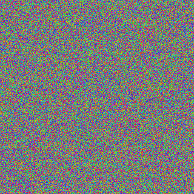 | 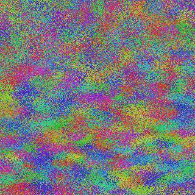 | 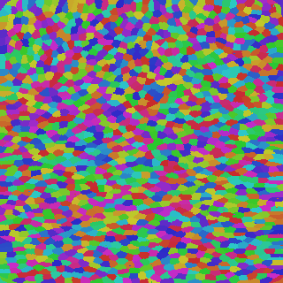 | 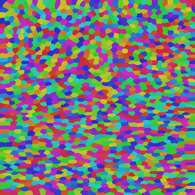 |

| Phase | Empty | Contiguity | Diameter | Size std | Agreement | Reassign |
|-------|-------|------------|----------|----------|-----------|----------|
| 0     | 0     | 0.004      | 418.9    | 29.4     | 0.999     | 6        |
| 10    | 0     | 0.005      | 415.9    | 38.7     | 0.999     | 104      |
| 19    | 0     | 0.013      | 409.9    | 50.1     | 0.998     | 176      |
| 20    | 152   | 0.916      | 129.0    | 30.2     | 0.999     | 266      |
| 25    | 4     | 0.999      | 17.4     | 12.6     | 0.999     | 7        |
| 30    | 0     | 0.999      | 16.8     | 12.3     | 0.999     | 0        |
| 99    | 0     | 0.999      | 16.8     | 12.3     | 0.999     | 0        |
| **Baseline** | 0 | **1.000** | **12.2** | — | — | — |

**Total splits: 997.** All dead clusters recovered via split mechanism.

**Key observations:**
- Phase 20 is the transition point (alpha goes from 0.95→1.0 at phase 19→20): 152 clusters die instantly when embeddings reach final values, triggering massive split recovery
- By phase 25 (5 converge phases): only 4 empty, contiguity=0.999
- By phase 30: fully converged, 0 reassignments — system is stable
- Final contiguity 0.999 matches baseline 1.000 — streaming matches offline quality
- **Scales perfectly from n=6,400 to n=102,400 with batch_size scaled proportionally**

### Scaling insight

batch_size must scale with n to maintain coverage fraction:
- 80×80 (n=6400): batch_size=256 → 4% coverage → converges in ~30 phases
- 320×320 (n=102400): batch_size=4096 → 4% coverage → converges in ~10 phases
- Rule of thumb: batch_size ≈ 0.04 × n
