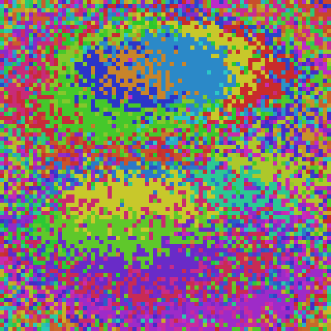
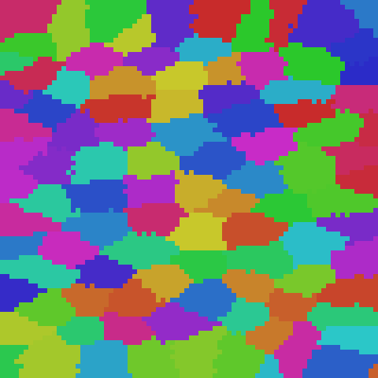
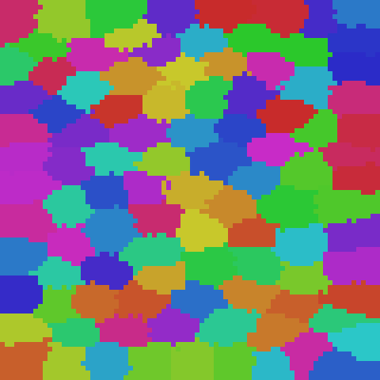
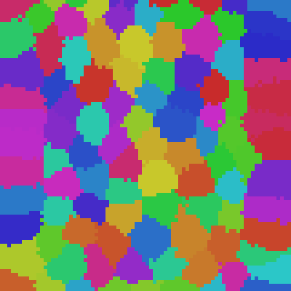

# ts-00017: Live Clustering — Integration Test

**Date:** 2026-03-16
**Status:** In progress
**Source:** `exp/ts-00017`

## Goal

Integrate streaming cluster maintenance from ts-00016 into the live DriftSolver
training loop. Clusters form simultaneously with embeddings — no post-hoc step.

## Approach

Added `_ClusterManager` to `main.py` with CLI args:
- `--cluster-m N` — number of clusters (0=disabled, requires `--knn-track`)
- `--cluster-init-tick N` — initialize clusters via GPU k-means at this tick
- `--cluster-report-every N` — save cluster visualization + print metrics
- `--cluster-split-every N` — attempt dead cluster recovery
- `--cluster-lr` — centroid nudge learning rate
- `--cluster-k2` — cluster-level KNN size

Per tick: `streaming_update_v3_gpu` runs on the same anchors used for skip-gram.
Periodic splits recover dead clusters. KNN lists refreshed from solver state at
each report interval.

Also exposed `dsolver._last_anchors` from `tick_correlation` so cluster manager
can use the same anchor set.

## Results

### Run 001: 80×80 gray saccades, m=100, 50k ticks

```
preset: gray_80x80_saccades
n=6400, m=100, dims=8, k2=10, lr_cluster=0.01
cluster_init_tick=1000, split_every=10, report_every=2500
Output: ~/data/research/thalamus-sorter/exp_00017/001_live_clusters_80x80_m100_50k/
Runtime: 552s (~11 ms/tick)
```

| Tick | Alive | Contiguity | Diameter | Splits | KNN spatial |
|------|-------|------------|----------|--------|-------------|
| 2500 | 100/100 | 0.192 | 93.6 | 132 | — |
| 5000 | 100/100 | 0.974 | 15.5 | 279 | 0.465 |
| 7500 | 100/100 | 0.998 | 13.0 | 301 | — |
| 10000 | 100/100 | **1.000** | 12.7 | 304 | 0.943 |
| 25000 | 100/100 | 1.000 | 11.8 | 306 | 1.000 |
| 50000 | 100/100 | 1.000 | 11.6 | 306 | 1.000 |

**Eval:** PCA=0.567, K10 <3px=96.9%, K10 <5px=100%

| Tick 2500 | Tick 5000 | Tick 10000 | Tick 25000 | Tick 50000 |
|-----------|-----------|------------|------------|------------|
|  |  |  |  |  |

**Key findings:**

1. **Clusters form live during training.** Contiguity reaches 1.000 by tick 10000
   (20% of training) and stays perfect through the remaining 40000 ticks. No
   post-hoc clustering needed.

2. **Zero impact on embedding quality.** Final eval metrics (PCA=0.567, K10=96.9%
   <3px) are identical to non-clustered baseline from ts-00016 Run 001.

3. **Minimal overhead.** ~11 ms/tick with clustering vs ~10 ms/tick without.
   The cluster maintenance adds ~1-2ms per tick (streaming update on 256 anchors).

4. **Self-healing works live.** 306 splits total, mostly in the first 5000 ticks
   during the turbulent early phase. After tick 10000, splits stop — system is
   stable. 100/100 clusters alive throughout.

5. **Cluster structure emerges WITH embeddings.** By tick 2500 (embeddings still
   chaotic), spatial patches are already forming. By tick 5000 (KNN spatial=0.465),
   clusters are nearly contiguous (0.974). The cluster structure tracks embedding
   convergence in real time.
