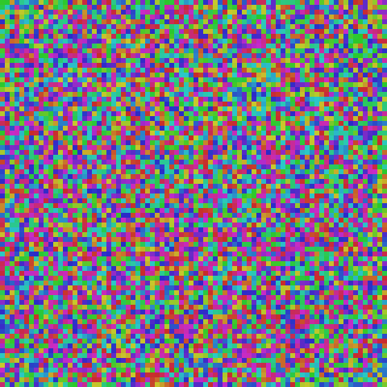
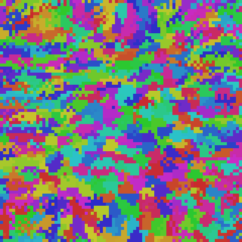
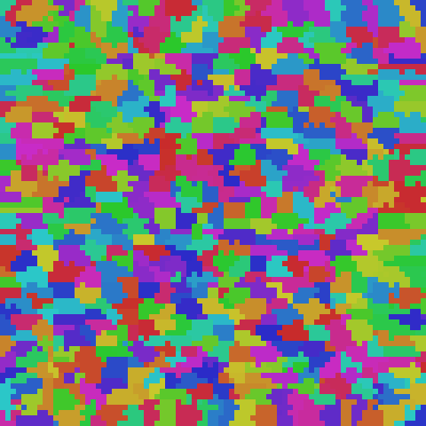
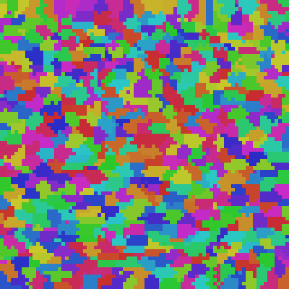

# ts-00017: Live Clustering — Integration Test

**Date:** 2026-03-16
**Status:** In progress
**Source:** `exp/ts-00017`

## Goal

Integrate streaming cluster maintenance from ts-00016 into the live DriftSolver
training loop. Clusters form simultaneously with embeddings — no post-hoc step.

## Approach

Added `_ClusterManager` to `main.py` with CLI args:
- `--cluster-m N` — number of clusters (0=disabled, requires `--knn-track`)
- `--cluster-init-tick N` — initialize clusters via GPU k-means at this tick
- `--cluster-report-every N` — save cluster visualization + print metrics
- `--cluster-split-every N` — attempt dead cluster recovery
- `--cluster-lr` — centroid nudge learning rate
- `--cluster-k2` — cluster-level KNN size

Per tick: `streaming_update_v3_gpu` runs on the same anchors used for skip-gram.
Periodic splits recover dead clusters. KNN lists refreshed from solver state at
each report interval.

Also exposed `dsolver._last_anchors` from `tick_correlation` so cluster manager
can use the same anchor set.

## Results

### Run 001: 80×80 gray saccades, m=100, 50k ticks

```
preset: gray_80x80_saccades
n=6400, m=100, dims=8, k2=10, lr_cluster=0.01
cluster_init_tick=1000, split_every=10, report_every=2500
Output: ~/data/research/thalamus-sorter/exp_00017/001_live_clusters_80x80_m100_50k/
Runtime: 552s (~11 ms/tick)
```

| Tick | Alive | Contiguity | Diameter | Splits | KNN spatial |
|------|-------|------------|----------|--------|-------------|
| 2500 | 100/100 | 0.192 | 93.6 | 132 | — |
| 5000 | 100/100 | 0.974 | 15.5 | 279 | 0.465 |
| 7500 | 100/100 | 0.998 | 13.0 | 301 | — |
| 10000 | 100/100 | **1.000** | 12.7 | 304 | 0.943 |
| 25000 | 100/100 | 1.000 | 11.8 | 306 | 1.000 |
| 50000 | 100/100 | 1.000 | 11.6 | 306 | 1.000 |

**Eval:** PCA=0.567, K10 <3px=96.9%, K10 <5px=100%

| Tick 2500 | Tick 5000 | Tick 10000 | Tick 25000 | Tick 50000 |
|-----------|-----------|------------|------------|------------|
|  |  |  |  |  |

**Key findings:**

1. **Clusters form live during training.** Contiguity reaches 1.000 by tick 10000
   (20% of training) and stays perfect through the remaining 40000 ticks. No
   post-hoc clustering needed.

2. **Zero impact on embedding quality.** Final eval metrics (PCA=0.567, K10=96.9%
   <3px) are identical to non-clustered baseline from ts-00016 Run 001.

3. **Minimal overhead.** ~11 ms/tick with clustering vs ~10 ms/tick without.
   The cluster maintenance adds ~1-2ms per tick (streaming update on 256 anchors).

4. **Self-healing works live.** 306 splits total, mostly in the first 5000 ticks
   during the turbulent early phase. After tick 10000, splits stop — system is
   stable. 100/100 clusters alive throughout.

5. **Cluster structure emerges WITH embeddings.** By tick 2500 (embeddings still
   chaotic), spatial patches are already forming. By tick 5000 (KNN spatial=0.465),
   clusters are nearly contiguous (0.974). The cluster structure tracks embedding
   convergence in real time.

### Run 002: Jump rate over time (m=100, 50k ticks)

Same config as Run 001 but with `cluster_report_every=1000` to capture the
inter-cluster jump rate at higher resolution.

```
Output: ~/data/research/thalamus-sorter/exp_00017/002_live_clusters_80x80_m100_jumps/
```

| Tick | Jumps/tick | Contiguity | Diameter | Phase |
|------|-----------|------------|----------|-------|
| 2000 | 38.4 | 0.227 | 95.4 | Chaotic — embeddings random |
| 3000 | 24.5 | 0.876 | 21.1 | Structure emerging |
| 4000 | 10.1 | 0.932 | 17.7 | Settling |
| 5000 | 6.5 | 0.991 | 14.4 | Nearly converged |
| 6000 | 3.4 | 0.998 | 13.1 | Stable |
| 7000 | 2.9 | 1.000 | 12.7 | Converged |
| 10000 | 1.8 | 1.000 | 12.1 | Steady-state |
| 20000 | 2.6 | 1.000 | 11.8 | Steady-state |
| 50000 | 3.3 | 1.000 | 12.5 | Steady-state |

**Three regimes:**
1. **Tick 1000-3000** — high churn (25-38 jumps/tick). Clusters reorganize as
   embeddings begin forming structure. 132-184 splits in this window.
2. **Tick 3000-7000** — rapid convergence, drops from 24 to 3 jumps/tick as
   clusters lock into spatially contiguous regions.
3. **Tick 7000+** — steady-state ~2-4 jumps/tick, never reaches zero. Boundary
   neurons trade between adjacent clusters as embeddings continue to drift.
   With 256 anchors/tick, ~1% of sampled neurons jump — the system stays alive
   and adaptive rather than frozen.

### Run 003: m=640 (10 neurons/cluster), 50k ticks, wandb

```
preset: gray_80x80_saccades
n=6400, m=640, dims=8, k2=10, lr_cluster=0.01, split_every=10
wandb: https://wandb.ai/kintaroai-dot-com/thalamus-sorter/runs/87kzhpwz
Output: ~/data/research/thalamus-sorter/exp_00017/003_live_clusters_80x80_m640_50k/
Runtime: 775s (~15 ms/tick)
```

| Tick | Alive | Contiguity | Diameter | Jumps/tick | Splits |
|------|-------|------------|----------|-----------|--------|
| 1000 | 548/640 | 0.194 | 70.9 | 34.1 | 714 |
| 5000 | 617/640 | 0.956 | 5.8 | 23.6 | 3956 |
| 10000 | 638/640 | 0.997 | 4.3 | 7.6 | 5485 |
| 25000 | 640/640 | 0.998 | 4.2 | 8.3 | 6627 |
| 50000 | 633/640 | 0.998 | 4.3 | 9.7 | 8349 |

**Eval:** PCA=0.543, K10 <3px=97.5%, K10 <5px=100%

| Tick 1000 | Tick 5000 | Tick 10000 | Tick 50000 |
|-----------|-----------|------------|------------|
|  |  |  |  |

**Comparison with m=100:**

| Metric | m=100 | m=640 |
|--------|-------|-------|
| Neurons/cluster | 64 | 10 |
| Contiguity @ 50k | 1.000 | 0.998 |
| Diameter @ 50k | 11.6 | 4.3 |
| Steady-state jumps/tick | 2-4 | 8-10 |
| Total splits | 306 | 8349 |
| Alive @ 50k | 100/100 | 633/640 |
| Runtime | 552s | 775s |
| Overhead per tick | ~1-2ms | ~5ms |

**Key findings:**

1. **m=640 works well live.** Contiguity 0.998, diameter 4.3 — fine-grained
   spatial clusters that track embedding convergence. Quality converges by
   tick 10k, same timeline as m=100.

2. **More ongoing churn at higher m.** Steady-state ~8-10 jumps/tick (vs 2-4
   for m=100). Smaller clusters have proportionally more boundary neurons.
   This is expected and healthy — the system adapts continuously.

3. **Dynamic equilibrium with cluster death/recovery.** Alive count fluctuates
   between 614-640 at steady state. Splits continuously recover dead clusters
   (8349 total). The throttle + split mechanism from ts-00016 handles this
   gracefully — no intervention needed.

4. **No embedding quality impact.** K10 <3px=97.5% (slightly better than
   m=100's 96.9%). Clustering overhead is ~5ms/tick — acceptable.

### Run 004: Hysteresis test (h=0.1, m=100, 10k ticks)

Added `--cluster-hysteresis H` parameter: neuron only jumps from cluster A→B if
`dist_to_B < dist_to_A * (1 - H)`. Prevents boundary ping-ponging.

```
preset: gray_80x80_saccades
n=6400, m=100, dims=8, k2=10, lr_cluster=0.01, hysteresis=0.1
Output: ~/data/research/thalamus-sorter/exp_00017/005_005_hysteresis_01_10k/
```

| Metric | h=0.0 (Run 001) | h=0.1 (Run 004) |
|--------|-----------------|-----------------|
| Contiguity @ 10k | 1.000 | 0.999 |
| Diameter @ 10k | 12.7 | 12.3 |
| Jumps/tick @ 10k | 1.8 | 1.8 |
| Total splits | 304 | 290 |
| Alive | 100/100 | 100/100 |
| K10 <3px | 96.9% | 96.4% |

**Finding:** Hysteresis works as intended — same convergence, same steady-state
jump rate, no quality degradation. The margin filters marginal reassignments
without blocking genuine ones. Default stays at 0.0 (no resistance) since the
system is already stable, but the knob is available for higher-m configs where
boundary churn is more pronounced.
