# ts-00019: Cluster Signal Rendering

**Date:** 2026-03-18
**Status:** In progress
**Source:** `exp/ts-00019`

## Goal

Currently cluster visualization color-codes each neuron by cluster ID using
arbitrary hue spacing. This tells us cluster shape and contiguity but nothing
about what the cluster represents.

Replace the arbitrary color with the **average signal value** of neurons in each
cluster. For grayscale input: each cluster gets brightness = mean pixel intensity
of its members at the current saccade position. For RGB: each cluster gets an
RGB color. This turns the cluster map into a low-resolution reconstruction of
the input image — showing that clusters correspond to meaningful spatial regions
of the visual field.

## What this tests

1. **Do clusters capture local signal structure?** If clusters are spatially
   contiguous (contiguity=1.000), and each cluster's members share similar
   pixel positions, then the mean signal should be smooth and image-like.

2. **Visual quality of cluster-based downsampling.** With m=640 clusters on an
   80×80 grid, each cluster averages ~10 pixels. The rendered output is an
   80×80 image where each pixel shows its cluster's mean signal — effectively
   a 640-color adaptive quantization of the input.

3. **Temporal coherence.** As the saccade position shifts, the cluster signals
   should update smoothly (since clusters are spatially contiguous). Rapid
   flicker would indicate unstable cluster boundaries.

## Implementation plan

The signal at any tick is the current saccade crop stored in `signals_np[:, t]`
(one value per neuron). For multi-channel (RGB), neurons are interleaved:
neuron `i` corresponds to pixel `i // sig_channels`, channel `i % sig_channels`.

To render cluster signal:
1. Get current signal frame (the latest saccade crop)
2. For each cluster, compute mean signal across member neurons
3. Paint each neuron's pixel with its cluster's mean signal value
4. Save as image alongside the existing color-coded cluster map

For grayscale (sig_channels=1): straightforward mean → grayscale image.
For RGB (sig_channels=3): need to average per-channel, then reconstruct color.
Multi-channel neurons need careful handling since pixel `(x,y)` maps to
`sig_channels` consecutive neuron indices.

## Results

### Run 002: Signal rendering (warm-start, mk=2, 20k)

```
warm-start from ts-00018 Run 001, 20k ticks, m=640, mk=2, lr=1.0, h=0.0
report_every=1000, --cluster-render-mode signal
Output: ~/data/research/thalamus-sorter/exp_00019/002_signal_compare_mk2_20k/
```

640/640 alive, contiguity=1.000 throughout. Each report saves both the raw
signal frame (`signal_NNNNNN.png`) and the cluster-averaged version
(`clusters_sig_NNNNNN.png`).

#### Tick 4000 (clusters converged)

| Raw signal | Cluster signal |
|---|---|
| 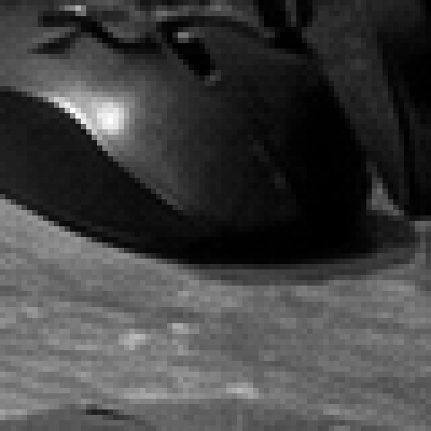 | 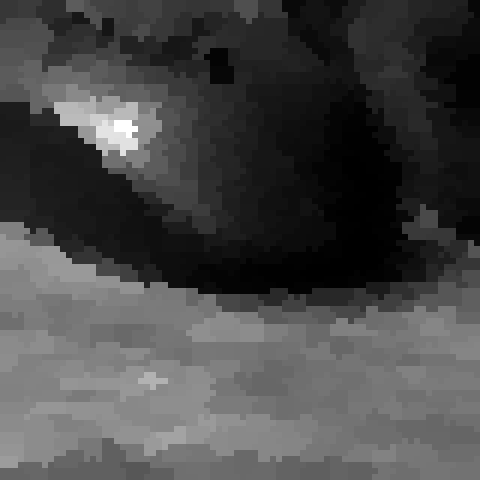 |

#### Tick 12000

| Raw signal | Cluster signal |
|---|---|
|  | 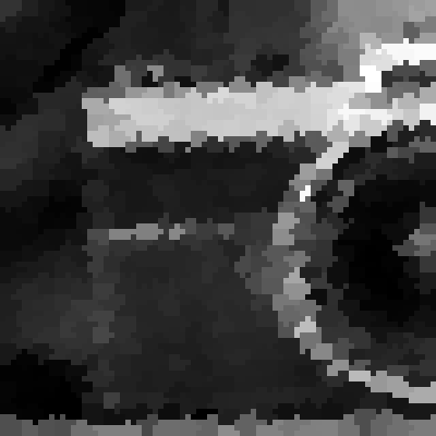 |

#### Tick 16000

| Raw signal | Cluster signal |
|---|---|
| 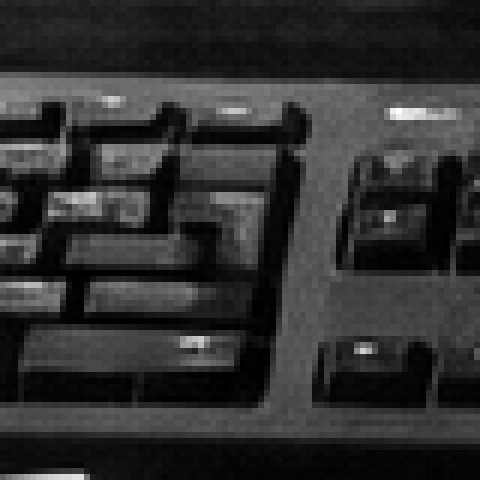 |  |

### Run 003: All three views (warm-start, mk=2, 20k, render=both)

Same config as Run 002 but with `--cluster-render-mode both` to save color-coded
cluster maps alongside signal renders.

#### Tick 10000

| Raw signal | Cluster signal | Cluster map |
|---|---|---|
|  | 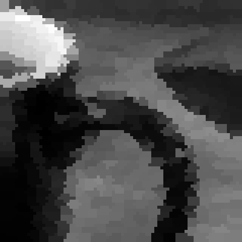 | 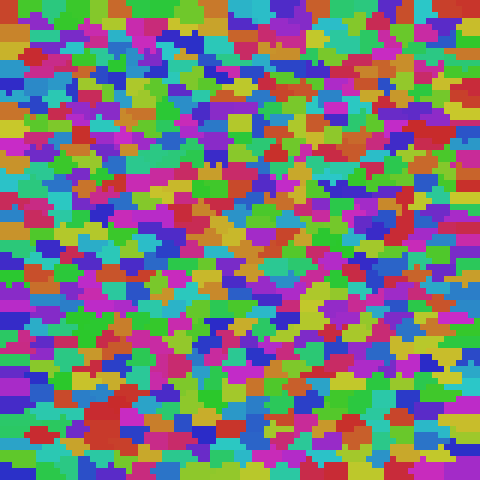 |

#### Tick 15000

| Raw signal | Cluster signal | Cluster map |
|---|---|---|
| 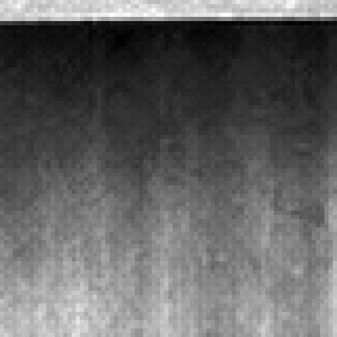 | 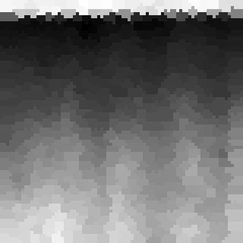 | 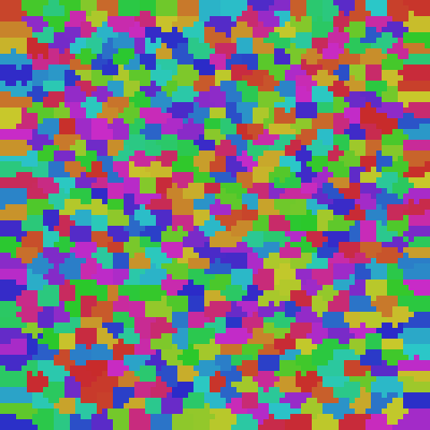 |

#### Tick 19000

| Raw signal | Cluster signal | Cluster map |
|---|---|---|
| 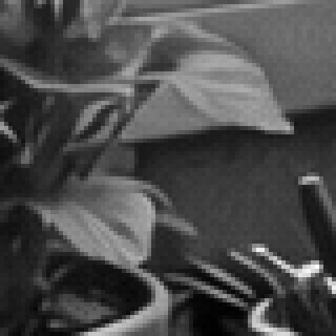 |  | 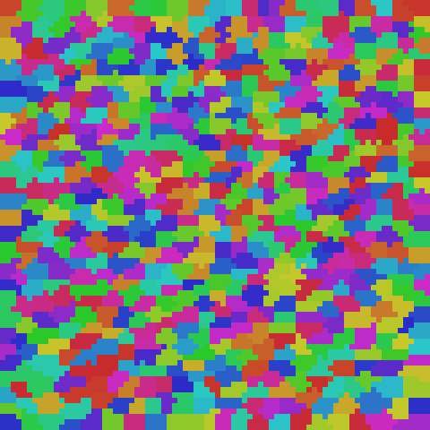 |

**Observations:**

Each saccade crop shows a different region of the source image. The cluster
signal is a faithful low-resolution reconstruction — edges, gradients, and
spatial structure preserved. Each of the 640 clusters averages ~10 pixels,
producing an adaptive superpixel quantization that follows the learned
topographic map.

The color-coded cluster maps show contiguous spatial patches (contiguity=1.000).
Each patch in the cluster map corresponds to a uniform-brightness region in the
cluster signal view — demonstrating that the topographic organization groups
spatially correlated neurons together.
