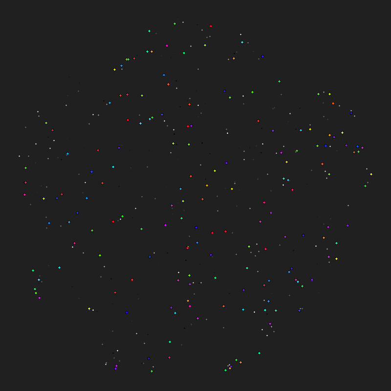
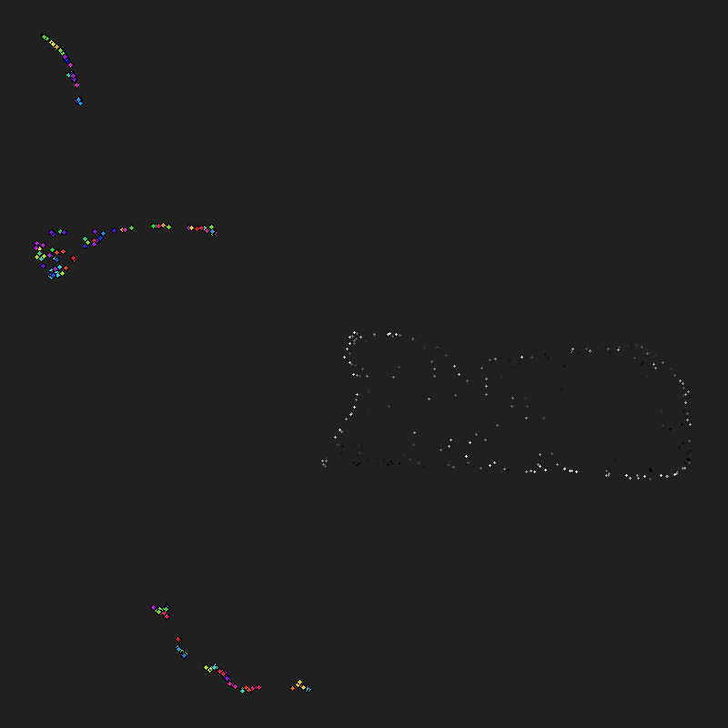
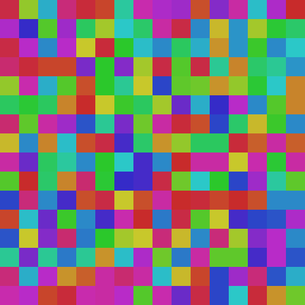
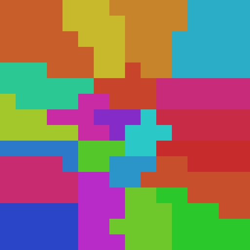
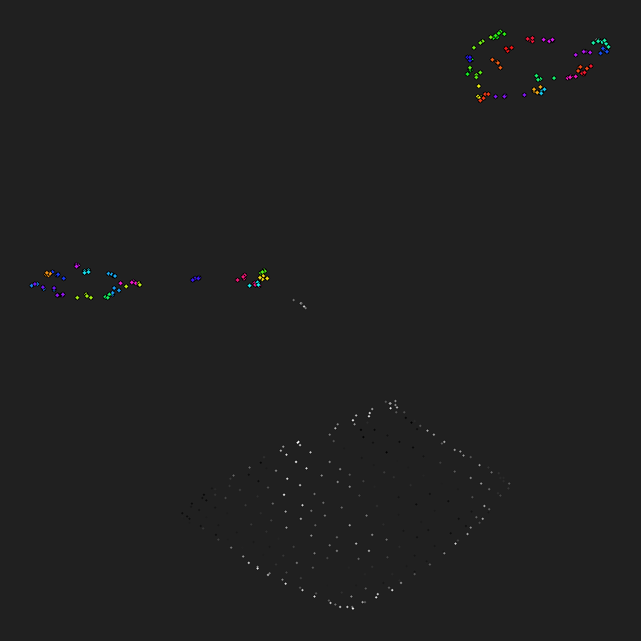
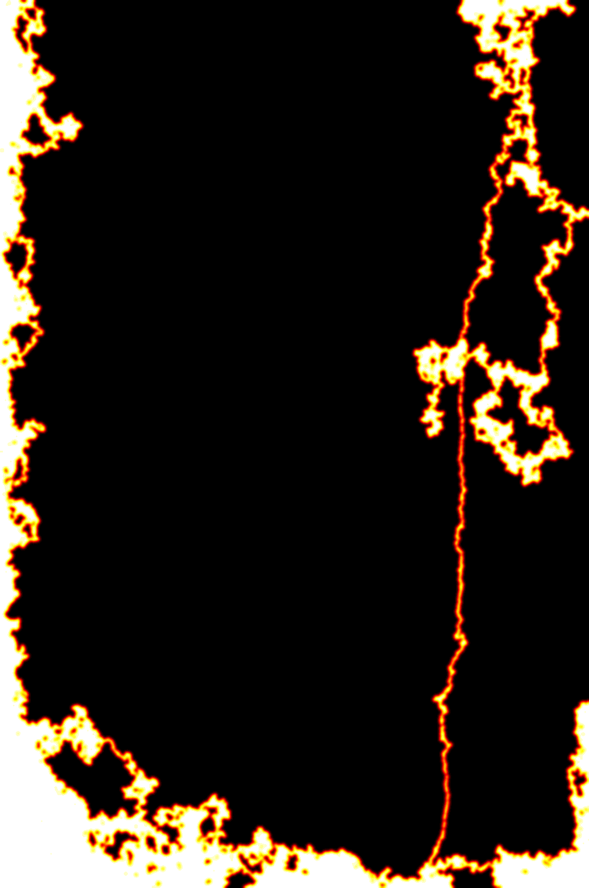

# ts-00021: Closing the Loop — Column Output as Neuron Input

**Date:** 2026-03-19
**Status:** In progress
**Source:** `exp/ts-00021`

## Goal

Close the perception-action loop by feeding column outputs back into the
signal buffer as additional input. Currently the signal flows one way:

```
saccade crop → neurons → clusters → columns → (dead end)
```

The column outputs have nowhere to go. This experiment extends the signal
buffer so that a portion of each tick's signal comes from the external world
(saccade images, as before) and another portion comes from the previous
tick's column outputs — creating a recurrent loop:

```
        ┌──────────────────────────────────────┐
        │                                      ▼
saccade crop → neurons[0..N-1] → clusters → columns
                  ▲                              │
                  │    neurons[N..N+K-1]          │
                  └──── (column output t-1) ──────┘
```

## Architecture

The signal buffer `T` currently has shape `(n, signal_T)` where every neuron
gets its value from the saccade crop (external input). We extend this:

- **External neurons** `[0, N)`: signal comes from saccade crop pixels, as
  before. These are the "sensory" neurons.
- **Feedback neurons** `[N, N+K)`: signal comes from the previous tick's
  column outputs. These are the "internal" neurons that carry top-down
  information back into the map.

With M clusters and `n_outputs` per column, the column output is
`(M, n_outputs)` = `M * n_outputs` scalar values. Each becomes the signal
for one feedback neuron. So `K = M * n_outputs`.

The feedback neurons participate in the same embedding space, get sorted by
the same topographic map, join clusters, and wire to columns — just like
sensory neurons. The only difference is where their signal comes from.

This means columns now receive a mix of:
- Raw pixel values from sensory neurons in their cluster
- Column output values from feedback neurons in their cluster

The feedback creates temporal depth — column outputs at tick `t` influence
cluster signals at tick `t+1`, which influence column outputs at tick `t+1`,
and so on. The system can develop internal representations that persist and
evolve beyond what the instantaneous saccade crop provides.

## Key Questions

1. Do feedback neurons self-organize into meaningful spatial positions in the
   topographic map, or scatter randomly?
2. Does the recurrent signal improve per-column differentiation (the weakness
   from ts-00020)?
3. Does the system develop stable attractor states — persistent internal
   patterns that survive across saccade positions?
4. How much feedback (K) relative to sensory input (N) is needed?

## Column Learning Dynamics

### Entropy-Scaled Learning Rate

Columns with uniform outputs (all 4 outputs ≈ 25%) learn at full rate to
differentiate quickly. Columns that have already differentiated learn slowly,
maintaining stability while still allowing gradual re-learning.

```
lr_col = lr_base * (entropy / max_entropy)
```

Controlled by `ENTROPY_SCALED_LR = True` in `column_manager.py`.

### Lower Temperature (0.5 → 0.2)

Default softmax temperature reduced from 0.5 to 0.2 for peakier winner-take-all
dynamics. Higher temperature keeps outputs near-uniform even when prototypes
diverge; lower temperature amplifies small differences into clear winners.

`--column-temperature 0.2` (was 0.5).

### Embedding Visualization

`--render-mode embed` saves `embed_NNNNNN.png` scatter plots at each
`cluster_report_every` interval alongside normal cluster maps. Shows all neurons
projected to 2D via PCA: sensory as small gray dots, feedback as larger colored
dots (color = column hue). Useful for tracking feedback neuron organization.

## Early Observations (10k ticks, 80×80, 10pp)

- Feedback neurons form a distinct cloud, completely separated from sensory
  neurons in embedding space. Zero mixed clusters — 589 pure-sensory, 474
  pure-feedback.
- Within-cluster input spread ≈ within-column output spread (0.35 vs 0.35),
  but outputs are NOT near their driving inputs (cosine 0.22, distance 2.1).
- Same-column feedback neurons cluster tighter (0.35) than random feedback
  pairs (0.54) — column identity is captured.
- Column prototypes are angularly well-separated (mean intra-column cosine ≈ 0)
  but softmax outputs were near-uniform for 46% of columns at temperature=0.5.

## Results

### Run 008: 80×80, 10pp, 10k ticks (temp=0.5, no entropy lr)

Config: `--cluster-neurons-per 10 --column-outputs 4 --column-feedback --lr 0.01`
M=1066, K=4264, n_total=10664. 29ms/tick, 336s total.

Clustering: 589/1066 alive, contiguity=0.387, diameter=26.3, stability=0.436.

**Embedding separation:** Complete segregation — zero mixed clusters. 589
pure-sensory, 474 pure-feedback. Feedback neurons form their own cloud in a
separate region of embedding space (centroid distance 1.67).

**Embedding statistics:**
- Sensory intra-distances: mean=1.53, per-dim std≈0.40
- Feedback intra-distances: mean=0.54, per-dim std≈0.13 (3× tighter)
- Cross distances: mean=2.02 (larger than either intra)
- Same-column output spread: 0.35 (tighter than random feedback pairs 0.54)
- Output-to-input-centroid cosine: 0.22 (weak alignment)

**Cluster composition:** Sensory clusters avg 10.9 neurons, feedback clusters
avg 9.0 neurons. Both evenly distributed despite complete type segregation.

**Column differentiation (temp=0.5):** Prototype directions well-separated
(mean intra-column cosine ≈ 0), but softmax outputs near-uniform for 46% of
columns. Max output probability: mean=0.387, 22% have clear winner (>0.50).
Winner distribution skewed toward output 0: [619/163/145/136].

### Run 009: 80×80, 10pp, 100k ticks (temp=0.5, no entropy lr)

Config: same as 008 but 100k ticks.

Clustering: 567/1066 alive, contiguity=0.496, diameter=19.4, stability=0.571.
Winner dist [442/212/222/190] — still skewed toward output 0.

Embedding separation persists at 100k — two distinct clouds on opposite
corners of PCA projection. No mixing emerged with longer training.

### Key Finding: Feedback Loop Does Not Close

The derivative-correlation metric used for neighbor discovery produces
fundamentally different signal profiles for sensory neurons (pixel crops in
[0,1]) vs feedback neurons (softmax probabilities in [0,1]). The temporal
derivatives have different variance structure, so the two populations never
correlate with each other. Result: they form completely isolated embedding
regions and never share clusters.

The feedback neurons do self-organize — same-column outputs cluster together,
column identity is captured in embedding directions — but this is an isolated
system that doesn't interact with the sensory representation.

### Run 011: 16×16, garden, 10pp, 5k ticks (temp=0.2, entropy-scaled lr)

Config: `--preset gray_16x16_garden -f 5000`
M=42, K=168, n_total=424. 47ms/tick, 279s total.

Clustering: 22/42 alive, contiguity=0.970, diameter=4.7, stability=0.84.
Eval: PCA=0.51, K10: mean=1.93, **94.5% within 3px, 100% within 5px**.
Winner dist [11/12/12/7] — well balanced columns.

Feedback neurons split into 2-3 clearly separated sub-clusters, each with
distinct column colors. Sensory neurons form a structured loop/manifold.

**Embedding at tick 500 (early):**



**Embedding at tick 5000 (converged):**



**Clusters at tick 500 (early):**



**Clusters at tick 5000 (converged):**



### Run 010: 80×80, 10pp, 100k ticks (temp=0.2, entropy-scaled lr)

Config: `--cluster-neurons-per 10 --column-outputs 4 --column-feedback --lr 0.001`
M=1066, K=4264, n_total=10664. 73ms/tick, 4330s total.

Clustering: 558/1066 alive, contiguity=**0.947**, diameter=**4.9**, stability=0.961.
Winner dist [472/205/209/180].

**Comparison with run 009 (temp=0.5, no entropy lr):**

| Metric       | Run 009 (t=0.5) | Run 010 (t=0.2 + entropy lr) |
|--------------|-----------------|------------------------------|
| Contiguity   | 0.496           | **0.947**                    |
| Diameter     | 19.4            | **4.9**                      |
| Stability    | 0.571           | **0.961**                    |
| Winner dist  | 442/212/222/190 | 472/205/209/180              |

Massive improvement in cluster spatial coherence from lower temperature +
entropy-scaled lr. Feedback neuron cloud shows L-shaped internal structure
(vs diffuse blob at temp=0.5). Populations still fully separated.

### XOR Synthetic Benchmark (runs 012-015)

**Setup:** 16×16 grid, `--signal-source xor`. Four quadrants with binary
features A, B, XOR=A^B, AND=A&B. Each tick draws random bits, held for 5
ticks. Tests whether columns can detect non-linear (XOR) features.

**Results across configs:**

| Run | lr    | batches | A    | B    | XOR  | AND  |
|-----|-------|---------|------|------|------|------|
| 013 | 0.001 | 1       | 0.11 | 0.26 | 0.20 | 0.20 |
| 014 | 0.001 | 2       | 0.11 | 0.26 | 0.17 | 0.20 |
| 015 | 0.01  | 2       | 0.17 | 0.29 | 0.17 | 0.22 |

Max |r| between any column output and each feature (500-tick sample after
10k training). All correlations at noise floor (~0.1-0.3), invariant to lr
and anchor count.

**Root cause:** Columns are per-cluster, and correlation-based clustering
separates A, B, XOR, AND into different spatial clusters. No column ever
sees neurons from multiple regions simultaneously, so no column can compute
cross-region functions like XOR.

For XOR detection, a column would need inputs from both region A and region B,
which requires them to share a cluster. But A and B are uncorrelated signals →
they cluster separately. The feedback loop doesn't help because feedback
neurons also form isolated clusters (see Key Finding above).

**Architectural implication:** The current per-cluster column architecture can
only detect features that are **local to one cluster** (i.e., variations among
neurons that already correlate enough to cluster together). Cross-cluster
non-linear features require either: (1) a mechanism to route information
between clusters (lateral connections, attention), or (2) a hierarchical layer
where cluster-level representations are combined.

## Next: Lateral Connections Between Columns

The feedback loop closes a vertical path (sensory → column → feedback neuron →
embedding space), but the missing piece is **horizontal** information flow
between columns. In the current architecture each column is an isolated unit
that only sees its own cluster's neurons. Non-linear features like XOR require
combining outputs from multiple columns.

### Proposed Architecture

Each column receives two types of input:
1. **Local input** (current): signal window from its cluster's wired neurons
2. **Lateral input** (new): outputs from neighboring columns in cluster-KNN
   space (knn2)

```
Column A ──outputs──→ lateral input to Column B
Column B ──outputs──→ lateral input to Column A
                      (via cluster knn2 neighborhood)
```

The cluster-level KNN graph (knn2) already tracks which clusters are near each
other in embedding space. Lateral connections would route column outputs along
these edges. A column in the XOR region would receive lateral inputs from
columns in the A and B regions (if those clusters are knn2 neighbors), giving
it the information needed to compute XOR.

### Key Design Questions

1. **What to send:** Raw column outputs (4 floats per column)? Winner ID only?
   Concatenated with local input or as a separate input stream?
2. **How many lateral inputs:** All knn2 neighbors (k2=16)? Top-k by distance?
   Would make column input size variable or require padding.
3. **Routing:** Static (wired at cluster init, updated on knn2 changes) or
   dynamic (attention-weighted based on current column outputs)?
4. **Timescale:** Lateral inputs from same tick (synchronous, requires
   ordering) or previous tick (asynchronous, simpler, like feedback neurons)?
5. **Learning:** Do lateral connection weights learn, or are they fixed
   projections? If learned, what's the learning signal?

### Simplest Version

Use previous tick's column outputs from knn2 neighbors as additional input
slots in the SoftWTA column. Each column currently has `max_inputs=20` slots.
With k2=16 neighbors × 4 outputs = 64 lateral values per tick. Could add a
separate `lateral_inputs` slot array alongside the existing neuron-signal slots.

This is analogous to how feedback neurons work, but instead of going through
the full embedding→cluster→column loop, lateral connections are a direct
column-to-column shortcut along the knn2 graph. Much faster information
propagation (1 tick vs many ticks for the embedding path).

## Motor Output: Saccade Steering

One column's 4 softmax outputs are treated as a motor signal that steers
the saccade direction each tick:

```
output 0: dx+    output 1: dx-
output 2: dy+    output 3: dy-

dx = (out_0 - out_1) * scale
dy = (out_2 - out_3) * scale
saccade_step = random_step + (dx, dy)
```

Since outputs are softmax (sum to 1), the system has a fixed budget. When
the column is uniform (all 0.25), net displacement is zero — pure random
walk as before. When it differentiates, the saccade gets steered.

`--motor-column` flag designates which cluster's column drives the motor.
Default: cluster 0 (arbitrary but deterministic).

### What to measure

1. **Saccade position histogram:** With vs without motor control. If the
   system learns to steer, certain image regions get visited more often.
2. **Motor output stability:** Does the motor column converge to consistent
   outputs, or oscillate randomly?
3. **Gaze-contingent structure:** Does the chosen gaze pattern correlate
   with image features (edges, textures, high-variance regions)?
4. **Closed-loop effect:** Does motor control change clustering quality
   (contiguity, stability) compared to pure random saccades?

### Run 017: 16×16, garden, motor-column 0, 10k ticks

Config: `--preset gray_16x16_garden --motor-column 0 -f 10000`
M=42, K=168, n_total=424. Contiguity=1.000, 98.3% within 3px.
Mean motor magnitude=1.34 px (on top of ±50 random step).

Cluster 0 is pure sensory: 10 neurons at grid positions (5-8, 3-5), a
small patch in the upper-middle of the 16×16 grid. The motor column
responds to local pixel variations at that specific patch — not a
global scene feature.

**Concern:** The motor column's neurons see the saccade crop at fixed
grid positions. When the motor output steers the saccade, the pixels
at those positions change, which changes the column output, which
changes the motor signal. This creates a tight feedback loop where the
motor column is effectively correlating with its own movement — it
sees the *consequence* of its own action, not an independent feature.
This may produce self-reinforcing drift (the saccade walks in one
direction because the column learned to output that direction when it
sees the texture that results from walking that direction) rather than
meaningful attention.

**To disentangle:** Need to compare motor-on vs motor-off runs on the
same image and check whether the motor column's outputs are stable
(learned preference) or follow the random walk (just echoing movement).
A truly useful motor signal would produce a non-uniform position
histogram concentrated on image regions with specific features.

### Motor Proprioception (runs 019-022)

Added 6 override neurons (last 6 sensory neurons) carrying:
- **Position** (2 neurons): normalized crop x,y position [0,1]
- **Urgency** (4 neurons): one per direction (dx+, dx-, dy+, dy-).
  Ramps at `urgency_rate` per tick when that direction hasn't moved,
  resets to 0 on movement. Acts as a "hunger" signal for exploration.

**Confidence-gated exploration:** When motor output is strong, random
saccade walk is suppressed. `rand_step *= (1 - confidence)` where
`confidence = min(1, motor_magnitude / motor_scale)`. System explores
when uncertain, exploits when confident.

**Run 019** (no random walk, urgency_rate=0.02):
Saccade got stuck — winner collapsed to `[42/0/0/0]`. Without random
walk to provide initial signal variety, all columns converge to the same
output. Motor magnitude=0.06 (near zero). Urgency saturated at 1.0 in
50 ticks but couldn't break the deadlock.

**Run 020** (saccade_step=5, urgency_rate=0.02, scale=10):
Working. Winner dist `[15/8/11/8]`, motor magnitude=1.01. Heatmap
shows two hotspots — gaze concentrating in specific image regions.
Contiguity=0.976, 91.2% within 3px. Small random walk provides
enough exploration while motor bias steers toward preferred regions.

**Run 021** (saccade_step=5, confidence-gated, urgency_rate=0.02):
Clear diagonal trajectory across garden image. Motor magnitude=0.70,
gaze confined to ~30% of image canvas along one path. Winner dist
`[12/15/6/9]`. The gaze follows what appears to be an edge/feature
boundary in the source image.

**Run 022** (urgency_rate=0.005, ~200 ticks to saturate):
Gaze hugs right edge of garden image with bright hotspot in top-right
corner. Motor magnitude=0.46 (lower — less urgency pressure). Winner
dist `[11/8/7/16]` — output 3 (dy-) dominant, matching the downward
trajectory.

**Key observation:** Motor column (cluster 0) is always pure sensory —
a small pixel patch whose response to local texture drives the saccade
direction. The system develops consistent gaze trajectories, not random
exploration. Whether these trajectories follow meaningful image features
(edges, textures) or are just self-reinforcing drift remains open.

### Run 023: Motor + proprio, 16×16, 100k ticks

Config: `--preset gray_16x16_garden --saccade-step 5 --motor-column 0
--motor-scale 10 -f 100000`, urgency_rate=0.005.

Clustering: 25/42 alive, contiguity=**1.000**, diameter=**3.8**,
stability=0.991. Eval: 97.2% within 3px.
Winner dist `[12/9/9/12]` — fully balanced, all 4 outputs active.
Motor magnitude=0.50, position uniformity=7.6.

Embedding shows three distinct populations: sensory neurons form a
clean diamond/square manifold (well-organized topographic map),
feedback neurons split into two groups — a ring-like cluster and
a smaller fragmented cluster.

**Embedding at 100k ticks:**



**Motor heatmap (100k saccade positions):**



### Run 026: 80×80, garden, motor, saccade_step=15, 100k ticks

Config: `--preset gray_80x80_garden --saccade-step 15 --motor-column 0
--motor-scale 15 -f 100000`
M=1066, K=4264, n_total=10664. lr=0.001.

Clustering: 446/1066 alive, contiguity=**0.066**, diameter=89.5.
Eval: 2.5% within 5px — **barely converged** at lr=0.001 with 100k ticks.
Winner dist [284/234/267/281] — well balanced.

**Cluster 0 is pure feedback** — 9 feedback neurons, 0 sensory. The motor
column is driven entirely by feedback signals, not pixel values. This creates
a closed loop with no sensory grounding.

**First mixed clusters observed:** 10 clusters contain both sensory and
feedback neurons. All 6 proprio neurons ended up in mixed clusters (each
paired with 1 sensory + several feedback). The urgency/position signals
apparently correlate enough with some sensory pixels to co-cluster.

**48 isolated feedback loops found:** Feedback-only clusters whose member
neurons come from columns whose own clusters are also pure feedback.
Completely self-referential circuits with no sensory input.

**Cluster composition:** 436 pure sensory, 620 pure feedback, 10 mixed.
The poor convergence (contiguity=0.066) means noisy clustering — feedback
neurons spread into many small isolated clusters.

**Implication:** lr=0.001 is too slow for 80×80 with feedback. Need either
higher lr, more anchor batches, or longer training.

### Run 027: 80×80, garden, motor, lr=0.01, 100k ticks

Config: `--preset gray_80x80_garden --lr 0.01 --saccade-step 15
--motor-column 0 --motor-scale 15 -f 100000`

Clustering: 632/1066 alive, contiguity=**0.982**, diameter=**4.1**,
stability=0.986. Eval: **98.8% within 3px, 99.9% within 5px**.
Winner dist [270/273/246/277] — fully balanced.

**Cluster 0 is pure feedback** (20 neurons). The motor column processes
feedback signals, not raw pixels. This is actually the desired architecture:
a two-layer processing chain where the motor column receives a summary of
what sensory columns detect, then steers the saccade based on that
higher-level representation:

```
pixels → sensory clusters → sensory columns → feedback neurons →
    motor cluster (fb) → motor column → saccade steering
```

106 isolated feedback loops. 631 pure sensory, 434 pure feedback, 1 mixed.
Motor magnitude=0.10, position uniformity=3.9 (fairly spread).
