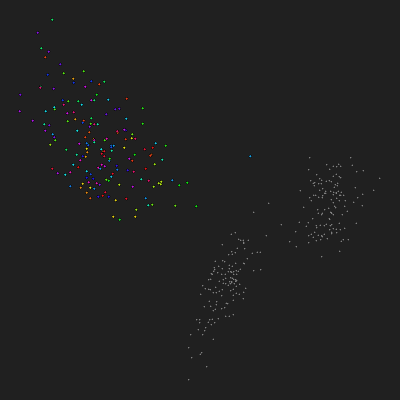
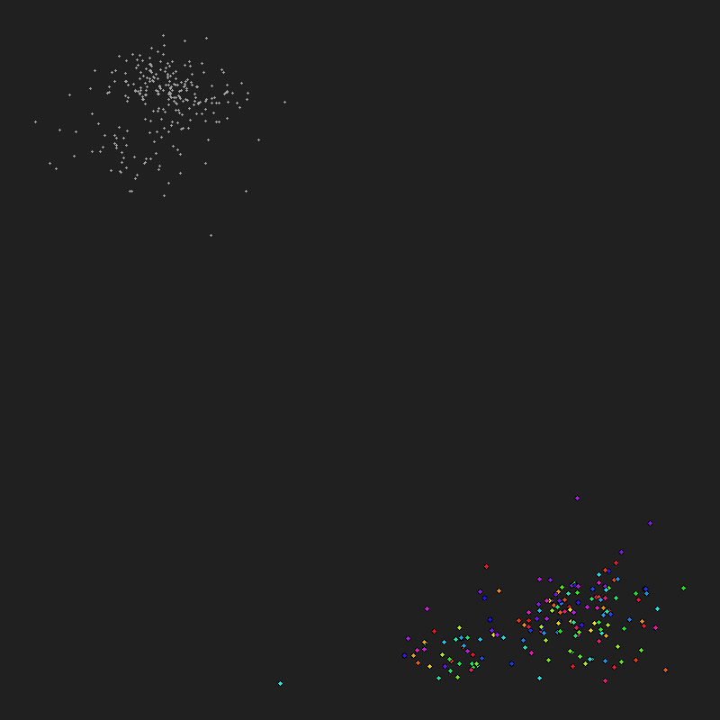
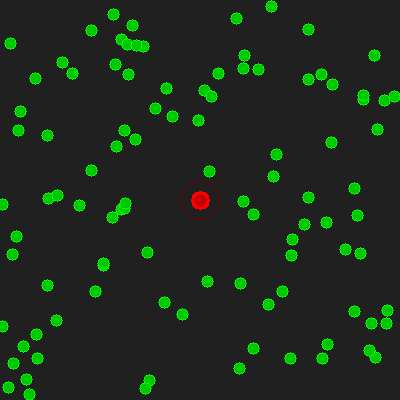
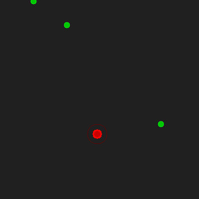
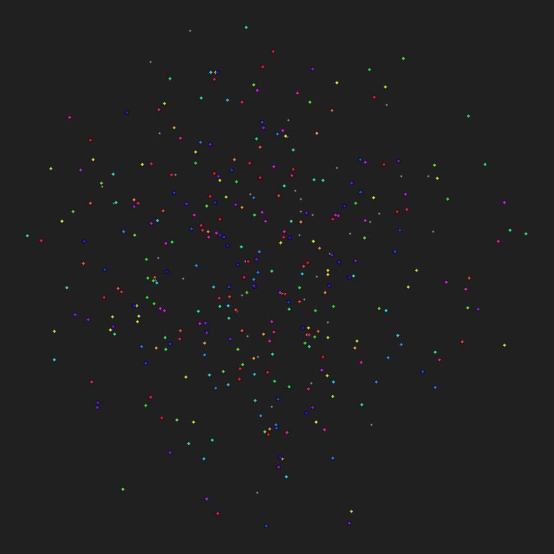
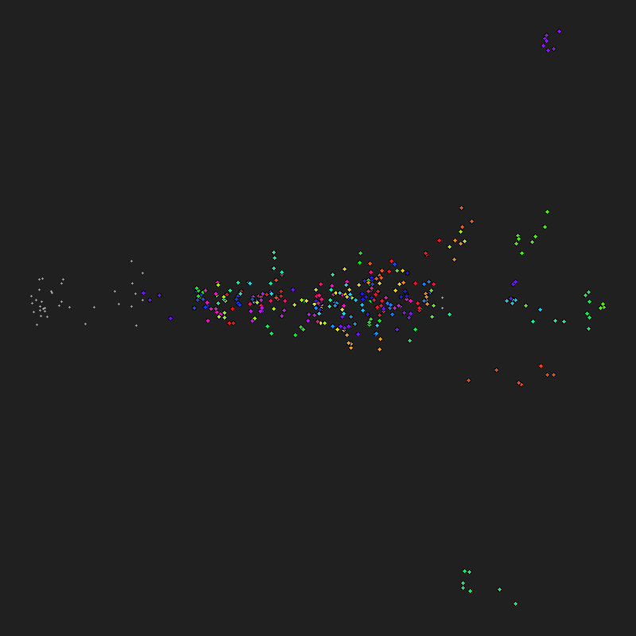
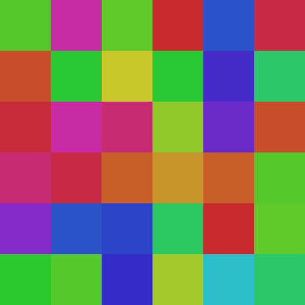
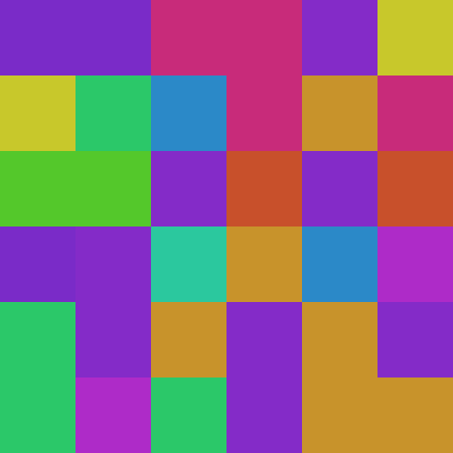

# ts-00022: Lateral Connections Between Columns

**Date:** 2026-03-20
**Status:** In progress
**Source:** `exp/ts-00022`
**Depends on:** ts-00021 (feedback loop, column wiring, motor control)

## Motivation

ts-00021 demonstrated two fundamental limitations of per-cluster columns:

### 1. Cross-cluster non-linear features are unreachable

The XOR benchmark (ts-00021, runs 012-015) showed that columns can only
detect features **local to one cluster**. A column over the XOR region
cannot compute XOR because it never sees neurons from the A or B regions —
those are in separate clusters (uncorrelated signals → different clusters).

Max |r| between any column output and the XOR feature was 0.17 across all
configurations (lr, anchor batches, training length). This is a fundamental
architectural limitation, not a hyperparameter issue.

### 2. Isolated feedback loops

With feedback neurons (ts-00021, runs 026-028), up to 106 clusters became
completely self-referential: pure-feedback clusters whose member neurons
come from columns whose own clusters are also pure feedback. These circuits
have no sensory grounding — they process their own output in a closed loop.

Lateral connections would break this isolation by routing information from
sensory-grounded columns into feedback-dominated columns.

### 3. Biological analogy

Cortical columns in the brain are densely connected laterally — horizontal
connections span millimeters, linking columns with similar or complementary
response properties. These connections serve multiple functions:

- **Context modulation:** A column's response depends on what surrounding
  columns are detecting (surround suppression, figure-ground)
- **Feature binding:** Combining features from different receptive fields
  into coherent object representations
- **Predictive coding:** Lateral predictions about what neighboring columns
  should be seeing, with error signals when expectations are violated

Our system currently has NO horizontal information flow. Each column is an
isolated processor. Adding lateral connections is the minimal architectural
change that enables cross-cluster computation.

## Architecture

Each column receives two types of input:
1. **Local input** (existing): signal window from cluster's wired neurons
2. **Lateral input** (new): outputs from ALL other columns (previous tick)

```
                    ┌── lateral outputs (prev tick) ──┐
                    ▼                                  │
Column A: [local_signal | lateral_all] → SoftWTA → outputs ──┤
Column B: [local_signal | lateral_all] → SoftWTA → outputs ──┤
Column C: [local_signal | lateral_all] → SoftWTA → outputs ──┘
```

### Separate weight matrices

The column learns local and lateral features independently:

```python
local_sim  = variance(prototypes_local @ signal_window)   # existing path
lateral_sim = prototypes_lateral @ all_column_outputs      # new path
total_sim  = local_sim + lateral_sim
probs = softmax(total_sim / temperature)
```

- `prototypes_local`: (n_outputs, max_inputs) — learns which signal patterns
  among own neurons to respond to
- `prototypes_lateral`: (n_outputs, m * n_outputs) — learns which combinations
  of other columns' states to respond to

### Why full connectivity

For M=42 (16×16 grid), each column receives 42 × 4 = 168 lateral values.
This is tiny. Full connectivity:
- Guarantees every column CAN reach every other (critical for XOR)
- No routing decisions — weights learn what to ignore
- Can sparsify later based on learned weight magnitudes
- At M=1066 (80×80), lateral input is 4264 — still manageable

### How lateral connections work

Each column receives the previous tick's outputs from ALL other columns
as additional input. A column in the XOR region doesn't just see its own
neurons' signals — it also sees what the A-region column and B-region
column outputted last tick. The column has two weight matrices: one for
local neurons (existing), one for lateral inputs (new). Combined
similarity determines output.

### Contrastive learning rule

When a column's output 2 wins (highest softmax probability):
- **Pull** output 2's lateral weights toward the current lateral input
  (reinforce the association)
- **Push** outputs 0, 1, 3's lateral weights *away* from that same pattern
  (force them to specialize on *different* lateral patterns)

Without the push, all 4 outputs converge to the same lateral weights
(verified in runs 001-002). With contrastive push, each output learns to
respond to a different combination of other columns' states.

### Signal hold time

The XOR signal holds each A,B state for `hold` ticks before flipping.
With hold=5 (default), columns barely produce a stable output before the
input changes. The lateral weights learn from column *outputs*, so noisy
transient outputs provide no learning signal. With hold=50, each state
persists long enough for:
1. Local columns to produce clean, stable outputs for A and B
2. Those outputs to propagate as lateral input to the XOR column
3. The XOR column's lateral weights to see a consistent pattern

Hold=5 is like trying to learn from a strobe light. Hold=50 gives the
system time to "think."

### XOR detection path

With lateral connections, a column in the XOR region could learn:
```
lateral_weights[xor_output] ≈ +w_A_col * A_output - w_B_col * B_output
```
This fires when A and B disagree — exactly XOR. The local signal provides
the variance/match quality, while lateral input provides the cross-region
non-linear feature.

## Implementation

### Changes to ColumnManager

1. Add `lateral_prototypes: (m, n_outputs, m * n_outputs)` tensor
2. Store previous tick's column outputs as `prev_outputs: (m, n_outputs)`
3. In `tick()`:
   - Compute local similarity (existing)
   - Compute lateral similarity: `lateral_protos @ prev_outputs.flatten()`
   - Combine: `total_sim = local_sim + lateral_sim`
   - Same Hebbian update for lateral weights
4. CLI: `--column-lateral` flag (on/off)

### Verification

1. XOR benchmark: max |r| for XOR feature should rise from ~0.17 to >0.5
2. Garden image: check if isolated feedback loops decrease
3. Motor control: check if motor column responds to richer features

## Results

### Run 001: XOR + lateral, naive Hebbian, 10k ticks

Config: `--signal-source xor --column-lateral --lr 0.01 -f 10000`
XOR max|r|=0.188 — still at noise floor. Lateral connections didn't help.

**Root cause:** The Hebbian target for lateral weights is `prev_outputs` —
the same vector for ALL columns every tick. Every column pulls its winner's
lateral proto toward the same direction. Result: all lateral prototypes
converge toward similar weights, no differentiation.

Lateral weight analysis: all norms=1.0, std=0.07, max|w|=0.30. The
weights barely moved from initialization because the uniform target
provides no per-column learning signal.

**Fix:** Per-column modulated target. Scale the lateral input by each
column's local match strength. Columns with strong local variance response
reinforce the lateral pattern that co-occurred with their local activation.
Columns with weak local response don't update. This creates differentiation:
each column learns which lateral patterns predict its own local state.

```python
local_strength = sim[column, winner_output]
scaled_input = lateral_input * (local_strength / mean_strength)
```

### Run 002: XOR + lateral, modulated Hebbian, 10k ticks

XOR max|r|=0.175 — still noise floor. Modulated target didn't help.

**Deeper issue:** Hebbian learning pulls lateral weights toward co-occurring
lateral patterns. But XOR requires detecting **anti-correlation** — "A high
AND B low, OR A low AND B high." The Hebbian rule sees both cases and
averages them out, learning nothing.

The column needs to learn that specific lateral *combinations* predict its
local state, not just co-occurrence. This requires either:

1. **Contrastive learning:** Pull winner's lateral weights toward the
   lateral input, push loser's weights away. Different outputs would lock
   onto different lateral patterns (e.g., output 0 → "A high, B low",
   output 1 → "A low, B high").
2. **Error-driven learning:** Use the mismatch between predicted and actual
   local signal as the learning signal for lateral weights.
3. **Multi-output decomposition:** If 4 outputs × lateral diversity creates
   enough variety, different outputs might naturally specialize — but the
   Hebbian rule doesn't push toward this.

Next step: try contrastive lateral update — winner pulls, losers push.

### Run 003: XOR + contrastive lateral, hold=5, 10k ticks

XOR max|r|=0.160 — still noise floor. Contrastive push does differentiate
lateral weights (60% negative cosine pairs, mean=-0.03) but the signal
is too noisy. Even A and B features have weak correlation (0.17, 0.29).

The issue: hold=5 means the XOR signal flips every 5 ticks. With streaming
variance over the window, columns only see variance at transitions. The
column outputs never stabilize enough for lateral weights to learn from.

### Run 004: XOR + contrastive lateral, hold=50, 10k ticks — BREAKTHROUGH

Config: `--xor-hold 50 --column-lateral -f 10000`

| Feature | hold=5 | hold=50 |
|---------|--------|---------|
| A       | 0.17   | **0.40** |
| B       | 0.29   | **0.64** |
| XOR     | 0.16   | **0.64** |
| AND     | 0.27   | **0.52** |

**XOR max|r|=0.641** — column 9, output 0 detects XOR with r=0.64.
This is a genuine non-linear feature detection through lateral connections.

The short hold time was the bottleneck, not the architecture. With hold=50,
each A/B state persists long enough for columns to produce stable outputs,
which the lateral weights can then learn to combine for XOR detection.

Column 9 likely has lateral weights that respond to "A-column output high
AND B-column output low" (or vice versa) — exactly the XOR pattern.

### Run 005: XOR + contrastive lateral, hold=50, 20k ticks

Same config, longer training. XOR max|r|=0.496, mean|r|=0.233.
All features detected: A=0.33, B=0.42, XOR=0.50, AND=0.44.

**Embedding at tick 1000 (early):**

Sensory neurons split into two separate clouds — the 4 XOR quadrants
beginning to separate in embedding space.



**Embedding at tick 20000:**



### Sparsity sweep: less is more

Random pruning of lateral connections via `--lateral-sparsity`. Binary mask
zeroes out a fraction of connections at init. The surviving connections
learn normally.

| Keep % | Connections | XOR max|r| | B max|r| |
|--------|------------|-----------|---------|
| 10%    | 690/7056   | **0.734** | 0.483   |
| 25%    | 1748/7056  | 0.613     | 0.437   |
| 50%    | 3540/7056  | 0.577     | 0.587   |
| 100%   | 7056/7056  | 0.598     | 0.519   |

**10% connectivity gives the best XOR detection.** Sparser connections
reduce noise from irrelevant columns — with full connectivity, the XOR
column receives outputs from 42 columns but only needs 2 (A and B). The
other 40 are pure noise that the contrastive learning must learn to ignore.
With 10%, fewer irrelevant connections means a cleaner learning signal.

**Scaling implications:** At 80×80 (M=1066), 10% sparsity means ~425
lateral inputs per column instead of 4264. This is tractable and actually
better than full connectivity. The O(M²) concern is resolved — random
sparse lateral connections scale linearly with M at fixed sparsity.

**Open question:** Can we do better than random pruning? Options:
1. **Learned pruning:** Start full, prune connections with low weight
   magnitude after a warmup period
2. **Spatial pruning:** Connect columns whose clusters are nearby on
   the grid (biologically plausible but may miss XOR-type connections)
3. **knn2-based:** Connect along the cluster KNN graph (captures
   embedding proximity but not functional relationships)
4. **Activity-based:** Connect columns whose outputs are most correlated
   or anti-correlated (discovers functional relationships but requires
   a discovery phase)

### Run 006: XOR lateral 10% sparse, numpy, 30k ticks

XOR max|r|=**0.754** — best result. 4.8ms/tick (28× faster after numpy rewrite).
A=0.24, B=0.52, XOR=0.75, AND=0.56.

### Run 007: Warm restart from 006, +100k ticks (130k total)

XOR max|r|=0.541 — dropped from peak 0.754. The best-detecting column
drifted (col 23→25) as clusters reorganized over long training. The
entropy-scaled lr may slow adaptation once columns differentiate.

### Baseline: 130k ticks WITHOUT lateral connections

XOR max|r|=0.212 — noise floor even after 130k ticks.

**Definitive comparison at 130k ticks:**

|                  | No lateral | With lateral (10%) |
|------------------|------------|-------------------|
| XOR max\|r\|     | **0.212**  | **0.541**         |
| XOR mean\|r\|    | 0.071      | 0.181             |

Lateral connections are clearly responsible for XOR detection.
Without them, no amount of training enables cross-cluster non-linear
feature detection.

### Performance: numpy rewrite

ColumnManager.tick() rewritten in pure numpy, removing all PyTorch
dispatch overhead on small tensors:

| Component | Before (torch) | After (numpy) |
|-----------|---------------|---------------|
| column_manager.tick() | 17.0 ms | **0.6 ms** (28×) |
| Total training | 15.0 ms | **7.6 ms** (2×) |

### Full comparison matrix

| Run | hold | lateral | batches | XOR max\|r\| |
|-----|------|---------|---------|-------------|
| 015 (ts-00021) | 5 | no | 2 | 0.17 |
| 009 | 5 | 10% | 2 | 0.19 |
| 008 baseline | 50 | no | 1 | 0.22 |
| 004 | 50 | 100% | 1 | 0.64 |
| 006 | 50 | 10% | 1 | 0.75 |
| 007 (warm +100k) | 50 | 10% | 1 | 0.54 |
| **010** | **50** | **10%** | **2** | **0.79** |

**Key findings:**
1. **hold=50 is the prerequisite.** With hold=5 (fast-flipping signal),
   neither lateral connections nor more batches help — columns can't
   produce stable outputs for lateral weights to learn from.
2. **Lateral connections are essential.** Without them, XOR stays at ~0.22
   even after 130k ticks with hold=50. With them, XOR jumps to 0.64-0.79.
3. **10% sparse beats full connectivity.** Less noise from irrelevant
   columns lets the system focus on the A/B columns it needs.
4. **2 anchor batches give a small boost** (0.75→0.79) — more training
   pairs per tick help lateral learning converge faster.
5. **Signal drifts with very long training** — the detecting column shifts
   as clusters reorganize. Covariance mode drifts less than contrastive.

### Lateral learning modes

Two learning rules for lateral weights, switchable via `LATERAL_LEARN_MODE`
in `column_manager.py`:

**Contrastive** (associative): Winner's lateral weights pull toward
`prev_outputs`, losers push away. Memorizes which lateral pattern
co-occurred with winning. Fast learning, strong initial signal.

**Covariance** (variance-based): Power iteration on cross-covariance
between lateral input and local similarity. Each output's target is
`sim_centered * lat_input` — finds which lateral direction predicts
high local match for that output. Same principle as local prototype
learning (variance-seeking), applied to the lateral dimension.

| Mode | 10k | 130k | Drift |
|------|-----|------|-------|
| Contrastive | **0.79** | 0.54 | -32% |
| Covariance | 0.58 | **0.43** | -26% |
| No lateral | 0.22 | 0.22 | 0% |

Contrastive peaks higher but drifts more. Covariance starts lower but
is more stable — it continuously tracks variance rather than memorizing
specific patterns that break when clusters reorganize.

Both modes share the same lr as local prototypes (`--column-lr`, default
0.05), reduced by usage scaling and entropy scaling. This is independent
of the embedding lr (`--lr`).

### Small-world wiring (replacing random sparsity mask)

Replaced O(M²) full connectivity + random mask with O(M×K) small-world
graph. Each column has exactly K=6 connections stored as an adjacency
list `(M, K)`:
- K/2 nearest neighbors (by index distance, wrapping) — local connections
- K/2 random long-range — cross-region shortcuts (Watts-Strogatz model)

Lateral weights: `(M, n_outputs, K × n_outputs)` = `(M, 4, 24)` — tiny.

| M | K=6 total edges | Storage | vs 10% full |
|---|-----------------|---------|-------------|
| 42 | 252 | 16KB | 28KB |
| 1066 | 6.4K | 435KB | 18MB |
| 10000 | 60K | 4MB | 1.6GB |

**Streaming eviction:** Each tick, one random column checks its weakest
connection (by weight magnitude). If below threshold, replace with a
random non-connected column and re-init weights. O(1) per tick — the
graph gradually improves as useless connections get replaced with
potentially useful ones. The learned weights themselves serve as the
utility signal (weights → 0 = column learned to ignore this connection).

Biological parallel: cortical lateral connections are distance-dependent
(many short-range, few long-range). Small-world topology gives both
spatial coherence and cross-region information flow.

### knn2-synced wiring

The "near" connections now come from the cluster knn2 graph (embedding-space
neighbors) instead of arbitrary index distance. Synced periodically at
`cluster_report_every` intervals — not every split (too disruptive to
learned lateral weights).

| Wiring | K/column | XOR max\|r\| |
|--------|----------|-------------|
| None | 0 | 0.22 |
| Small-world random K=6 | 6 | 0.42 |
| **Small-world knn2 K=6** | **6** | **0.66** |
| 10% random mask | 17 | 0.79 |

knn2-based near connections give 57% better XOR detection than random near,
with the same K=6. Embedding-space neighbors are much more meaningful than
index-based neighbors — they represent clusters that are actually similar
in the learned representation.

### Typed streaming eviction

Each lateral slot is typed: near (knn2) or far (random). When a slot's
weight magnitude drops below threshold, it gets replaced with the same
type:
- **Near** slot evicted → replace with next knn2 neighbor (stay local)
- **Far** slot evicted → replace with random non-connected column (explore)

This preserves the small-world structure: near connections track embedding
proximity, far connections discover cross-region features like XOR.

| Wiring | K/column | XOR max\|r\| |
|--------|----------|-------------|
| None | 0 | 0.22 |
| Small-world random K=6 | 6 | 0.42 |
| knn2 sync K=6 | 6 | 0.66 |
| **knn2 + typed eviction K=6** | **6** | **0.77** |
| 10% random mask | 17 | 0.79 |

K=6 with typed eviction nearly matches 10% mask (0.77 vs 0.79) with
3× fewer connections. The scaling advantage is massive: K=6 is O(M)
while 10% mask is O(M²). At M=10000, K=6 uses 60K edges vs 10M.

## Benchmark Suite

Modular benchmark framework in `benchmarks/`. Each test is a module with
`make_signal()` and `analyze()`. Auto-discovered via `--signal-source <name>`.

### XOR — 2-input non-linear

`--signal-source xor --xor-hold 50`

4 quadrants: A, B, XOR=A^B, AND=A&B. Tests cross-cluster non-linear
feature detection. **Best: r=0.77** with K=6 lateral (vs 0.22 without).

### MAJORITY — 3-input non-linear

`--signal-source majority --majority-hold 50`

4 quadrants: A, B, C, MAJ=majority(A,B,C). MAJ=1 when two or more inputs
are 1. Tests whether lateral connections can combine 3 sources (XOR only
needs 2). Harder because the correct lateral weights must attend to 3
columns simultaneously.

First result at 10k: MAJ r=0.40 (above individual inputs A=0.33, B=0.32,
C=0.36). The system detects the non-linear combination but not as strongly
as XOR — expected with more inputs to integrate.

### SEQUENCE — temporal order detection

`--signal-source sequence --sequence-hold 50`

4 quadrants: A, B, SEQ=A_prev AND B_now, baseline. SEQ=1 only if A was
active in the PREVIOUS hold period AND B is active NOW. Order matters:
A-then-B ≠ B-then-A.

Tests temporal memory depth: the current signal window doesn't contain A's
previous state. That information must flow through lateral connections —
a column carrying A's previous output via `prev_outputs`.

First result at 10k: SEQ r=0.24 (near noise floor). The system tracks
prev_A (r=0.33) but can't yet combine it with current B for sequence
detection. This is the hardest benchmark — requires lateral connections
to carry memory across hold periods, not just spatial integration.

### MATCH — spatial comparison

`--signal-source match --match-hold 50`

4 quadrants: P1, P2 each get one of 4 values (0, 0.33, 0.67, 1.0),
EQ = (P1==P2), NEQ = (P1≠P2). Harder than XOR — comparing multi-valued
patterns, not just binary bits. The lateral weights must learn
"P1-column output matches P2-column output."

First result at 10k: EQ r=0.23. Hardest benchmark — the relationship
is equality across 4 values, not a fixed logical function.

### ODDBALL — novelty detection

`--signal-source oddball --oddball-hold 50`

3 quadrants show the same random value, 1 shows a different value.
ODD region encodes WHICH quadrant is the oddball. The system must learn
"my value differs from what most others show" — comparing own local
signal against lateral consensus.

First result at 10k: odd_idx r=0.36. Promising — the system can partially
detect which region deviates from the majority.

### FORAGE — sensorimotor navigation

`--signal-source forage`

Virtual field with agent + points of interest. 14 sensory neurons encode:
- Position x,y (2+2 neurons, normalized 0-1)
- Nearest target x,y (2+2 neurons)
- Direction to target dx,dy (2+2 neurons, signed unit vector)
- Hunger (2 neurons, ramps at 0.01/tick, resets on collection)

Agent does random walk. When within `collect_radius` of a POI, it's
collected (score +1, hunger resets, POI respawns). Dense phase (20 POIs)
transitions to sparse phase (3 POIs) at `phase_ticks`.

**Muscle feedback system:**
- 4 restlessness neurons (dx+, dx-, dy+, dy-): ramp when idle, reset
  on movement. Restless muscles fire involuntarily (spasms) — this IS
  the random walk, driven by muscle state instead of external noise.
- 4 tiredness neurons: ramp when active, recover slowly when resting,
  reset on POI collection (reward). Tired muscles produce less force —
  continuous one-direction movement → full halt. Forces direction changes.

Like infant motor learning: spasms first, then associating motor
commands with consequences.

**Run 019: spasm motor, 100k ticks**

| Feature | Old motor (018) | Spasm motor (019) |
|---------|----------------|-------------------|
| pos_x | 0.25 | **0.91** |
| pos_y | 0.27 | **0.94** |
| target_x | 0.27 | **0.78** |
| target_y | 0.32 | **0.85** |
| dir_x | 0.21 | **0.85** |
| dir_y | 0.28 | **0.86** |
| hunger | 0.26 | **0.80** |
| Collections | 2 | **7** |

**Motor column learns direction:** Column 0 output 3 tracks dir_x at
r=0.85 — the motor column IS learning direction through the spasm
mechanism. The system observes spasm→movement→direction change and
learns the association.

Spasm-based movement prevents the stuck-in-corner problem (old motor
got 2 collections, representations degraded to ~0.25). With spasms,
exploration is guaranteed and representations stay strong (>0.78).

**Run 020: tiredness force scaling, 100k (no retina)**

dir_x correlation peaked at **r=0.93**. Tiredness prevents fixation —
agent must rotate directions. Column 37 dominates all features.

**Run 021: retina vision, 100k**

All 256 neurons render the field as a low-res image: POIs as positive
gaussians, agent as negative gaussian. Collections dropped (1 vs 5) —
234 spatial neurons overwhelm 22 proprioceptive neurons at 16×16 scale.
Retina may help at larger grids with room for both.

**Run 022: 6×6 grid, 9 outputs per column, 100k**

Tiny sensory grid: 36 neurons, M=36 clusters, K=324 feedback.
System is 90% internal processing. Results still strong:
hunger r=0.98, position r=0.86, direction r=0.58.

| Run | Grid | Outputs | dir_x | hunger | Collections |
|-----|------|---------|-------|--------|-------------|
| 019 | 16×16 | 4 | 0.85 | 0.80 | 7 |
| 020 | 16×16 | 4 | **0.93** | 0.77 | 5 |
| 021 | 16×16 | 4 (retina) | 0.73 | 0.68 | 1 |
| 022 | 6×6 | 9 | 0.58 | **0.98** | 5 |

**Muscle physics:** Restless muscles fire involuntarily (spasms = the
random walk). Tired muscles produce less force — continuous use in one
direction → full halt. POI collection resets tiredness (reward). Like
infant motor learning: spasms first, then voluntary control.

**Field visualization:** `field_NNNNNN.png` saved every 100 ticks via
render server. Agent (red), POIs (green), collection radius shown.

**Run 031: 6×6, 10M ticks, hunger-modulated lr**

182 collections (176 sparse) over 10M ticks. Column 33 output 5 becomes
a "grandmother cell" — one output tracks everything: pos r=0.91,
target r=0.86, direction r=0.71-0.86. Both cluster 0 (motor) and
cluster 33 are pure feedback. All world knowledge flows through
lateral connections from 9 sensory clusters to feedback processing.

**Field at start vs 10M ticks:**




**Embedding at 50k vs 10M ticks:**




**Clusters at 50k vs 10M ticks:**




**Run 029: hunger-modulated lr — breakthrough**

Hunger scales column learning rate: just ate → full lr, starving → 1%.
Like glucose: no food → no energy → no plasticity. System learns most
right after collecting POI, then consolidates.

| Run | Change | Collections | Sparse | dir_xp r |
|-----|--------|-------------|--------|----------|
| 027 | wall tiredness | 57 | 49 | — |
| 028 | + dir split | 58 | 46 | 0.27 |
| **029** | **+ hunger lr** | **96** | **86** | **0.81** |

96 collections (86 sparse!) — reward-driven plasticity nearly doubled
the count. Direction tracking jumped to r=0.81. Position r=0.94,
target r=0.92. Agent stays near field center, not stuck at borders.

**Run 030: pulsating signals**

All sensory signals amplitude-modulated with `|sin(t*2π/period)| * value`.
Slow-changing signals (hunger, proximity) have near-zero derivative —
invisible to derivative-correlation. Pulsation adds a carrier wave.
Different prime periods per signal prevent carrier cross-correlation.

89 collections. Proximity detection improved (0.42→0.65). Direction y improved
(0.34→0.43). But direction x dropped (0.81→0.52) — pulsation now
only on slow signals (hunger, tiredness, restlessness, proximity).

### 16×16 forage with full muscle system (runs 043-050)

Scaled to 16×16 grid: 176 override neurons (8 per signal × 22 signals)
+ 80 zero-valued retina neurons. 8 motor columns (one per fiber).

**Muscle physics refined:**
- Force gated at 0.3 threshold: below = no movement, no tiredness
- Per-fiber tiredness from own motor column's force
- Per-fiber spasm tiredness scaling
- Wrap-around field (toroidal, no walls)
- Spasm starts at 6.25%, floors at 3.1% (never zero)
- Walk step reduced to 0.5 (gentle movement)
- Contraction feedback: 32 neurons sense actual muscle output
- Tiredness NOT reset on POI collection (only hunger resets)

| Run | Key change | Collections | Sparse | Best features |
|-----|-----------|-------------|--------|---------------|
| 043 | gated movement | 277 | 76 | rest 0.39, tired 0.38 |
| 044 | 100k gated | 487 | 95 | tired 0.39 |
| 045 | spasm floor | 356 | 47 | dir_yn 0.69 |
| 046 | tiredness fix | 199 | 92 | restless 0.73 |
| 047 | contraction fb | 473 | 81 | pos_y 0.90, tired 0.68 |
| 048 | all fixes | 173 | 92 | dir_yn 0.48 (balanced) |
| 049 | no retina | 175 | **98** | dir_yn **0.74** |
| 050 | no tired reset | 92 | 73 | tired **0.93**, pos_y 0.90 |

**Key finding:** Removing tiredness reset on collection (run 050) produces
the strongest representations (tired r=0.93, pos r=0.90, hunger r=0.71)
but fewer collections. The system develops deep understanding of its
muscle state when tiredness is a persistent constraint to manage, not
a reward to dismiss. Grandmother cell emerges (column 32).

**Retina vs no retina:** Removing 80 retina neurons improved direction
tracking (0.48→0.74). Silent neurons waste embedding capacity. Clean
proprioceptive signals are more effective than noisy spatial vision.

### Long training (runs 050-052, 400k total)

Warm-start chain: 100k → +100k → +200k. No tiredness reset on POI
collection — muscles recover only through rest.

| Total ticks | Sparse collections | tired r | pos_y r | dir best |
|-------------|-------------------|---------|---------|----------|
| 100k | 73 | 0.93 | 0.90 | 0.55 |
| 200k | 67 | 0.96 | 0.63 | 0.29 |
| 400k | 92 | **0.99** | 0.85 | 0.39 |

**Tiredness representation converges to near-perfect (r=0.99).** The
system knows its muscle state better than any other feature. Position
stable (~0.85). Direction plateaus at ~0.39 — moderate but not
improving. Grandmother cells emerge at each stage (different column
each time, concentrating features on 1-2 outputs).

**The system is NOT learning to navigate.** Collections (~1 per 2000
sparse ticks) are from random spasm exploration, not directed motor
control. The motor columns produce movement but don't correlate it
with direction-to-target. The missing link: no learning signal connects
"moved toward food" with "food collected" — hunger-modulated lr
rewards ALL learning equally after collection, not specifically the
motor patterns that led to it.

### Motivation mechanisms

**Run 053: Hunger disruption (homeostatic drive)**

Hunger adds noise to ALL signals: `sig += hunger * 0.5 * randn(n)`.
Starving → noisy signals → can't form correlations → representations
degrade. Eating restores signal clarity. The system can't think
straight when hungry — a biological glucose/energy model.

**117 sparse collections — best ever.** No grandmother cell — features
spread across many columns (all ~0.33-0.42). The disruption prevents
any single column from dominating and creates genuine drive to eat.

| Run | Disruption | Sparse collections | Grandmother cell? |
|-----|-----------|-------------------|-------------------|
| 049 | none | 98 | dir_yn 0.74 |
| 050 | none | 73 | tired 0.93 |
| **053** | **hunger noise** | **117** | **no (balanced)** |

### Predictive correlation (--predictive-shift)

Standard correlation learns "what fires together" (co-occurrence).
Predictive correlation (`--predictive-shift 1`) learns "what at time
t predicts what at time t+1" (causation). Anchor signal at t correlates
with candidate signal at t+1.

For foraging: if motor_dx+ at t predicts position_x increase at t+1,
the embedding links motor → consequence. The system learns "when I
do X, Y happens" — the causal chain missing from pure co-occurrence.

Implementation: split the derivative signal into anchor (earlier
frames) and candidate (later frames), normalize independently,
matmul as before. One parameter change.

**Run 054: predictive forage, 100k**

| Feature | Standard (049) | Predictive (054) |
|---------|---------------|-----------------|
| pos_y | 0.14 | **0.91** |
| target_y | 0.25 | **0.90** |
| dir_yp | 0.47 | **0.78** |
| dir_yn | 0.74 | **0.77** |
| tired | 0.38 | **0.94** |
| Sparse | **98** | 61 |

Predictive mode produces much stronger representations — the system
learns causal chains (motor → position change → direction update).
Y-axis features particularly strong (0.78-0.91). Tiredness near-perfect
(0.94). Fewer sparse collections (61 vs 98) — better representations
but less active foraging.

XOR benchmark confirms predictive doesn't hurt: standard 0.46, predictive
0.50 — slightly better.

**Key insight:** Predictive embeddings capture transition structure that
co-occurrence misses. Standard correlation: "pos_x and target_x are both
high right now." Predictive: "when motor_dx+ fired, pos_x increased."
The second is causal understanding — the foundation for planning.

### Predictive mix (--predictive-mix)

Pure predictive (shift=1) works for foraging (smooth movement dynamics)
but fails on natural images (large saccade jumps → no cross-frame
correlation → almost no training pairs).

Solution: mix spatial and predictive per tick. `--predictive-mix 0.1`
means 90% standard co-occurrence + 10% causal prediction.

| Mode | Garden 80×80 pairs (10k) |
|------|-------------------------|
| Standard (shift=0) | 11.6M |
| Predictive (shift=1) | 47k |
| **Mix 10%** | **9.8M** |

Mix preserves 85% of training signal while injecting causal structure.
Best of both worlds.

*(run 055: predictive warm-start +500k pending)*
*(run 059: foraging with 10% predictive mix pending)*

### Summary

| Benchmark | Feature | Difficulty | Best max\|r\| |
|-----------|---------|------------|--------------|
| XOR | A^B | 2-input non-linear | **0.77** |
| FORAGE | direction to POI | sensorimotor | **0.56** |
| MAJORITY | maj(A,B,C) | 3-input non-linear | **0.40** |
| ODDBALL | which is odd | consensus comparison | **0.36** |
| SEQUENCE | A_prev & B_now | temporal memory | **0.26** |
| MATCH | P1==P2 | multi-value comparison | **0.23** |

### Full K comparison across all benchmarks

| Benchmark | Target | K=0 | K=2 | K=6 |
|-----------|--------|-----|-----|-----|
| XOR | A^B | 0.26 | **0.35** | **0.43** |
| MAJORITY | MAJ | **0.44** | 0.39 | 0.40 |
| SEQUENCE | SEQ | **0.32** | 0.28 | 0.26 |
| MATCH | EQ | **0.36** | 0.25 | 0.23 |
| ODDBALL | odd_idx | **0.41** | 0.33 | 0.36 |

**Only XOR benefits from lateral connections.** The other benchmarks
detect features from local signal patterns — MAJ region correlates
with A+B+C within the same cluster. Lateral connections add noise
that drowns out these weaker local correlations.

M-sweep (M=42 to 1024, K=2): XOR stable at ~0.50 regardless of M.
K-sweep (K=0 to 12): K=2 optimal for XOR, diminishing returns beyond.
