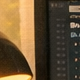
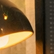

# Thalamus Sorter — Design Principles

## What this system does

Discovers topographic spatial organization from temporal correlations alone. Neurons that fire together end up as spatial neighbors — the thalamic principle. No supervision, no precomputed neighborhoods, no ground truth layout.

## Design goal: capture the full richness of neural activity

The embeddings should encode **everything meaningful about a neuron's activity pattern**, not just its spatial position on the grid. Spatial proximity is one important structure, but there is more:

- **Correlation strength**: Two neurons 3px apart may have very different correlation profiles — one in a smooth region (high correlation with all neighbors), another on an edge (high correlation in one direction, low in another). The embedding should reflect this.
- **Multi-scale neighborhood structure**: A neuron may be tightly correlated with its immediate neighbors but also weakly correlated with distant neurons that share a texture or color. Both relationships should be encoded.
- **Channel/modality identity**: In multi-channel input (RGB), each channel produces a distinct activity pattern. The embedding should capture channel membership as a natural emergent property, not as something we engineer in.
- **Temporal dynamics**: Neurons that respond to the same edge orientations, motion directions, or texture frequencies share temporal response patterns even if spatially distant. These functional similarities should be encoded.
- **Activity characteristics**: A neuron in a high-contrast region has different variance and temporal structure than one in a flat region. These differences carry information about what the neuron "sees."

This is why we use **dot product with high-dimensional embeddings** rather than forcing everything into a 2D spatial map. A D=8 or D=16 embedding can simultaneously encode spatial position (2-3 dims worth), channel identity (1-2 dims), local texture properties (remaining dims). Euclidean distance in 2D would collapse all of this into just "how far apart are they."

The rendering step (PCA/UMAP → 2D grid) is lossy by design — it extracts the spatial component for visualization. But the full embedding is the real output and preserves the complete learned structure.

## Architecture

Two-stage pipeline:

1. **Signal → Neighbor discovery**: Random anchor sampling, derivative-correlation scoring against random candidates from a rolling temporal buffer. Outputs variable-length "sentences" of correlated neurons.
2. **Sentences → Embeddings**: Dual-vector dot product skip-gram (W and C vectors), sliding window pairs, negative sampling. Outputs continuous D-dimensional embeddings that capture correlation structure.

Rendering (PCA/UMAP projection + Voronoi quantization) is purely for visualization — the embeddings are the real output.

### Why dot product (not Euclidean)

The correlation mode uses dot product with dual vectors (W, C) rather than Euclidean distance on a single position vector. This is deliberate:

- **Dot product captures richer structure.** Angular relationships in high-D can encode nuances beyond simple spatial proximity — channel identity, correlation strength, multi-scale neighborhoods. Euclidean mode forces everything into a spatial distance metric, which may discard useful information.
- **Dual vectors (W, C) prevent feedback loops.** Single-vector dot product collapses (ts-00005). Separate W and C vectors break the symmetry — W encodes "what I am", C encodes "what my neighbors look like".
- **No L2 normalization** (default `--normalize-every 0`). Vector magnitudes grow to ~4× unit length and stabilize — this natural magnitude growth IS the annealing mechanism. At magnitude ~4, dot products are ~16× larger, sigmoid saturates, gradients shrink, and the system self-dampens. Normalization prevents this equilibrium and hurts spatial quality (ts-00014: 99.5% <3px without normalization vs 88-96% with).
- **Spatial layout is derived, not learned directly.** The embeddings capture correlation structure; PCA/UMAP then projects to 2D for spatial rendering. This separation means the embeddings can encode structure that doesn't map to a flat 2D grid (e.g., channel clusters with internal spatial organization).

The Euclidean mode (`tick_euclidean`) exists as an alternative for precomputed-neighbor scenarios but is not used in the correlation pipeline.

## What works

- **Dual-vector dot product skip-gram** without normalization — captures correlation structure including nuances beyond pure spatial proximity. Vector magnitudes grow to ~4× and self-stabilize, providing natural annealing.
- **Sliding window pairs** from variable-length sentences: transitive inference (B correlated with A and C → B-C pair) gives 10-20x more training signal than anchor-only pairs
- **Derivative correlation scoring** (`--use-deriv-corr`): Pearson correlation on temporal derivatives. Dead neurons produce zero score naturally, no variance gating needed. 97-98% K-neighbor precision with proper threshold
- **D=8-16** embedding dims: D<3 collapses, D=8 is the practical minimum, D=16 helps for complex spatial distributions
- **k_sample proportional to N**: maintains constant sampling fraction (~3%) regardless of grid size
- **sigma proportional to grid size**: sigma ~ grid_size/10 keeps correlation reach constant

## What doesn't work

- **D=2 continuous drift** without external signal: collapses to 1D
- **Single-vector dot product** (no W/C separation): feedback loop, uniform PCA, no spatial structure
- **Low threshold** (0.1) on garden images: admits color-similarity noise pairs that overwhelm spatial signal (ts-00015). Use 0.5 for all deriv_corr signals
- **Fixed k_sample at larger grids**: k_sample=200 at 160x160 gives 65% dead anchors
- **Frequent L2 normalization** (normalize_every=100): prevents natural magnitude growth that provides self-annealing. Keeps effective lr permanently high, producing 88-96% <3px vs 99.5% without normalization (ts-00014)
- **Gaussian noise signals with T<200**: |r| < 0.005, below noise floor
- **T=200 buffer at >500k ticks**: signal churn destabilizes embeddings; T=1000 is the stable default

## Constraints to preserve

### Biological plausibility
- **Hebbian principle**: only pairwise correlations, no global optimization
- **Local random sampling**: each neuron samples random peers, not all-to-all
- **No global operations** except periodic L2 normalization (debatable; could be local normalization)
- **Derivative correlation** preferred over raw MSE: neural systems respond to changes, not absolute levels. Dead neurons (constant signal) naturally get zero contribution

### Correlation quality requirements

Good neighbor discovery depends on the quality of pairwise correlation estimates. Three conditions must hold for a pair to be informative:

1. **Silent neurons must produce zero correlation.** If either neuron has constant (or near-constant) signal, the pair tells us nothing about spatial proximity. MSE between two silent neurons is ~0 (false positive!). Derivative correlation handles this naturally: constant signal → zero derivative → zero norm → zero score. MSE requires explicit variance gating or thresholding to avoid this.

2. **Both neurons must have high variance.** Correlation is only meaningful when both signals vary enough to distinguish co-variation from noise. Low-variance neurons (flat regions of the image, dead pixels) produce unreliable scores even when not fully silent. Covariance mode (`use_covariance`) naturally downweights these since `cov = corr × std_a × std_b`. For MSE mode, the saccade walk must ensure all neurons see varying content — this is why step size matters.

3. **Global scene changes must not produce false neighbors (flickering problem).** A brightness flicker, exposure change, or global illumination shift affects all neurons simultaneously. Every neuron's signal shifts by the same amount → low MSE between all pairs → anchor discovers hundreds of "neighbors" that are actually just co-flickering. This is solved by `--max-hit-ratio`: if an anchor's hit rate exceeds the threshold (e.g., 10% of candidates pass), it's seeing a global signal and gets discarded. This filter has zero cost on clean signals but is essential as a safety net.

**Scoring method comparison:**

| Method | Silent neurons | Low variance | Flickering | Per-neuron mean needed |
|--------|---------------|-------------|------------|----------------------|
| MSE | false positive (MSE≈0) | unreliable | vulnerable | yes |
| Pearson corr | undefined (div/0) | noisy | partially resistant | yes |
| Covariance | zero (std=0) | downweighted | partially resistant | yes |
| Derivative corr | zero (norm=0) | downweighted | resistant | no |

Derivative correlation is the most robust and is the **default scoring method**: dead neurons contribute nothing, low-variance neurons are naturally downweighted, and global additive shifts cancel out in the derivative. MSE with `--max-hit-ratio` also works in practice for clean saccade signals but is no longer used in presets.

### Signal processing
- **Rolling saccade buffer**: (n, T) float32 buffer refreshed by random walk over source image. T=1000 balances stability and refresh rate
- **No mean subtraction needed** with derivative correlation (derivatives are naturally zero-mean for stationary signals). MSE mode requires per-neuron mean subtraction
- **Threshold precision > recall**: high threshold (few but correct neighbors) beats low threshold (many but noisy). Skip-gram learner tolerates missing pairs but not false pairs

### Scaling rules
- `k_sample ~ 0.03 * n` (3% sampling fraction)
- `sigma ~ grid_size / 10`
- Dead anchor rate should be 10-15%. If >50%, k_sample too low. If <5%, k_sample wastefully high
- `--max-hit-ratio 0.1` as safety net: filters anchors correlated with everything (global signals like brightness flicker). Should always be set in production.

## Parameters and tradeoffs

### Anchor sampling (`anchor_sample`, `batch_size=256`)

Controls how many neurons act as anchors per tick and how they're processed. Two mutually exclusive CLI flags:
- `--anchor-sample N`: set total unique anchors directly (e.g. `--anchor-sample 500`)
- `--anchor-batches M`: compute as `M × batch_size` (e.g. `--anchor-batches 2` → 512)
- Default: `batch_size` (256)

`batch_size` is the GPU batch dimension — how many anchors are processed in parallel. `anchor_sample` is the total unique anchors per tick, split into sequential chunks of `batch_size`.

Implementation: `randperm(n)[:anchor_sample]` selects unique anchors (capped at n), then `split(batch_size)` into sequential chunks. Each chunk gets independent candidate sampling, correlation, and skip-gram updates. Peak memory stays constant (determined by `batch_size × k_sample × T`).

| anchor_sample | batch_size | GPU batches | Chunks          | Memory |
|---------------|------------|-------------|-----------------|--------|
| 256 (default) | 256        | 1           | 256             | 1×     |
| 500           | 256        | 2           | 256 + 244       | 1×     |
| 1000          | 256        | 4           | 256+256+256+232 | 1×     |
| 6400 (all)    | 256        | 25          | 25 × 256        | 1×     |

- More anchors = more pairs/tick = faster convergence, but linear wall-clock cost per tick
- `batch_size=256` is a reasonable GPU batch; `anchor_sample` scales coverage without increasing memory
- At 80×80 (n=6400): 5k ticks with `--anchor-sample 512` ≈ 10k ticks with default 256, same wall time

### k_sample (candidate pool per anchor)

Number of random candidates each anchor compares against. **Must scale linearly with n** to maintain a constant sampling fraction.

**`anchor_sample` and `k_sample` are independent knobs.** `anchor_sample` controls coverage (how many neurons get a turn as anchor). `k_sample` controls discovery reach (how many candidates each anchor probes). `threshold` is also independent of both — it's a property of the signal (near neighbor correlation vs far neuron correlation), not the sampling. Calibrated threshold: **0.5 for deriv_corr** (both saccades and garden images — see Saccade signal section below).

| Grid | n | k_sample | Fraction | Dead anchor rate |
|------|---|----------|----------|-----------------|
| 80x80 gray | 6,400 | 200 | 3.1% | ~15% |
| 160x160 gray | 25,600 | 800 | 3.1% | ~14% |
| 80x80 RGB | 19,200 | 600 | 3.1% | varies |
| 80x80 RGBG | 25,600 | 800 | 3.1% | varies |

**Why linear scaling**: Each anchor needs to probe enough of the population to find its true neighbors. If the fraction drops, most anchors find zero neighbors (dead ticks). At 160x160 with k_sample=200, 65% of anchors are dead (ts-00012). Restoring 3.1% fraction fixes it.

**Multi-channel note**: With RGB, ~2/3 of sampled candidates are cross-channel and will never pass MSE threshold — effectively wasting sampling budget. The useful same-channel sampling is k_sample/channels. This doesn't break convergence (saccades RGB produces same pair rate as grayscale) but means RGB is inherently less efficient per sample.

**TODO**: Auto-adaptive k_sample — track dead anchor rate, double k_sample if >15%, halve if <5%.

### Correlation threshold

Minimum derivative correlation for a candidate to be accepted as a neighbor. Controls precision vs pair volume.

With deriv_corr (the default and recommended method), **threshold=0.5 works for all tested images** — both saccades and garden. This was established in ts-00015 after discovering that the old garden threshold of 0.1 was admitting massive numbers of color-similarity noise pairs.

- **Too strict** (>0.7): pair starvation — too few candidates exceed this correlation
- **Too loose** (0.1 for garden): admits distant same-color pixels as neighbors. At threshold=0.1, garden generates 706M pairs in 50k ticks but only achieves 78% <3px. The noise pairs encode color similarity rather than spatial proximity.
- **Sweet spot** (0.5): clean signal for both saccades and garden. Garden at 0.5 produces 179M pairs in 50k ticks and achieves 99.7% <3px.

The skip-gram sliding window is noise-tolerant (ts-00009: transitive pairs help even with false positives), but ts-00015 showed that excessive noise (4:1 noise-to-signal ratio at threshold=0.1) overwhelms even this tolerance. **Threshold precision matters more than pair volume.**

**Tradeoff**: `precision × pairs/tick` — want both high enough. If pairs/tick < 1000, the learner is starving regardless of precision.

### Saccade step size

Pixels the random walk moves per frame in the source image. Each frame, the crop window jumps to a random position within `step` pixels of its current location.

- **Large step (50)**: covers more of the image → diverse training signal, broader spatial sampling. Each frame shows a substantially different region.
- **Small step (5)**: consecutive frames overlap heavily → stronger local temporal correlation between neighboring pixels, but explores the image slowly (may not see the full image in T=1000 frames)

**Step=50 is the correct default for both images** when using deriv_corr with threshold=0.5 (ts-00015). The old guidance that garden needed step=5 was based on a threshold misconfiguration (threshold=0.1).

| Image | Step | Threshold | Pairs (50k) | <3px | KNN spatial | Notes |
|-------|------|-----------|-------------|------|-------------|-------|
| garden | 5 | 0.5 | 8.7M | 0.4% | 0.89 | **Starved** — too few pairs above threshold |
| garden | 50 | 0.5 | 179M | 99.7% | 0.998 | **Correct** |
| garden | 5 | 0.1 | 706M (50k) | 78% | 0.95 | Old config — noise overwhelms |
| saccades | 50 | 0.5 | 213M (10k) | 96.2% | 0.99 | Reference |

**Why step=5 fails with threshold=0.5**: Garden pixels within a 5px saccade window rarely produce derivative correlations above 0.5. The small window means consecutive frames are nearly identical — derivatives are small, correlations are noisy. Step=50 provides the spatial diversity needed for meaningful temporal variation.

#### Saccade signal visualization

The source images have very different spatial structure:

**Garden** (1024×1536, colorful flowers and foliage):


**Desktop** (1536×1024, warm brown desk/objects):


Each tick, the saccade window crops an 80×80 region from the source. The crop position random-walks with the configured step size. Below are the first 5 and last 5 frames (out of T=1000) showing how different step sizes explore the image.

**Garden step=5** — consecutive frames barely move, heavy overlap:

First 5:     

Last 5:     

**Garden step=50** — each frame jumps to a substantially different region:

First 5:     

Last 5:     

**Desktop step=50** — same step size, smoother image:

First 5:     

Last 5:     

With step=5, garden frames are nearly identical — neighboring pixels see the same content and produce low derivatives. With step=50, each frame shows a different region, creating the temporal variation that derivative correlation needs to identify spatially close pixels.

### Embedding dimensions (D)

Number of dimensions in the W and C vectors.

- **D < 3**: collapses, insufficient capacity
- **D = 8**: practical minimum. Encodes spatial structure well for simple layouts. All grayscale experiments use D=8
- **D = 16**: helps for complex spatial distributions. Garden.png R channel improved 23→51% <5px going 8→16D
- **D > 16**: not yet tested, likely diminishing returns

**Multi-channel tradeoff**: With RGB, the embedding must encode both channel identity and within-channel spatial position. More dims give more room for both. 8D works when each channel has simple spatial structure; 16D needed for complex channels.

### Buffer size (T)

Number of temporal frames in the rolling signal buffer.

- **T=200**: fast refresh, good for early convergence, but noisy MSE at >500k ticks
- **T=1000**: stable default, balances refresh rate and MSE reliability
- **T=2000**: best local structure (98% <5px) but non-planar global layout

**Tradeoff**: longer buffer = more stable MSE estimates = better discrimination, but slower adaptation to signal changes and more memory (n × T float32).

### Learning rate (lr=0.001) and convergence

Skip-gram update step size. Initial value lr=0.001 for all runs.

- Too high: oscillation, structure doesn't stabilize
- Too low: slow convergence

**This system is designed to run indefinitely** — potentially for days, weeks, or longer — continuously refining embeddings from a live signal stream. Convergence must happen naturally without a predetermined training length. A constant lr prevents convergence: embeddings jitter around optimal positions forever (ts-00014: KNN overlap plateaus at ~0.58 with constant lr).

**Dual annealing via `--lr-decay` + `--normalize-every`** (ts-00014):

The algorithm couples lr decay to normalization events, creating a self-regulating convergence mechanism that works without knowing the total training duration:

1. **Intra-cycle self-dampening** (automatic, free): Between normalizations, skip-gram updates grow vector magnitudes → dot products increase → sigmoid saturates → gradients shrink toward zero. The system naturally slows down within each cycle.
2. **Inter-cycle lr decay** (controlled, monotonic): At each normalization event, vectors are reset to unit length (restoring gradient flow) but lr is multiplied by the decay factor. Each cycle starts with full-strength gradients at a lower lr than the last.

The result is a series of diminishing warm-restarts. Early cycles make large structural changes; late cycles do fine positioning. The system asymptotically converges without needing to know when to stop.

Best tested configuration (ts-00014): `normalize_every=5000, lr_decay=0.8` — achieves 0.95 KNN overlap with 96.2% <3px spatial quality at 50k ticks. The decay factor and normalization interval together control the convergence speed: `lr_final = lr_init × decay^(ticks / normalize_every)`.

**Caution**: If lr decays too aggressively (decay=0.5), embeddings freeze before fully sorting — KNN stabilizes (0.997) but spatial quality degrades (94.8% vs 96.2%). Monitor both KNN stability AND spatial quality to detect over-dampening.

### Negative sampling (k_neg=5)

Number of random negative samples per positive pair. Push-away force prevents embedding collapse.

- k_neg=5 used across all experiments, not heavily tuned
- Lower: faster per tick but may not prevent collapse
- Higher: stronger repulsion, may over-separate

### Normalization interval (normalize_every=5000)

How often to L2-normalize W and C vectors.

- Prevents magnitude blow-up in dot product mode
- **Too frequent** (100): keeps effective lr permanently high, prevents convergence. Acts as a periodic "gradient wake-up" that never lets the system relax.
- **Too infrequent**: long periods of near-zero gradients (sigmoid saturation) where the system learns nothing
- **Sweet spot** (1000–5000): allows natural self-dampening within each cycle while keeping the system from fully stalling. Acts as natural annealing — early in each cycle updates are large, late in each cycle they shrink.
- Normalization frequency interacts with lr_decay: together they control convergence speed (see Learning rate section above)

### Sliding window size (window=5)

Context window for generating skip-gram pairs from sentences.

- Each sentence = [anchor, neighbor₁, neighbor₂, ...]
- Window=5: each token pairs with up to 5 tokens on each side
- Larger window = more transitive pairs = more training signal per sentence
- Too large: distant transitive pairs add noise
- 5 is the default word2vec window, works well here

## Multi-channel behavior (ts-00013)

When multiple signal channels (R, G, B) are fed as independent neurons:
- **Channel identity always dominates** spatial proximity in embeddings, regardless of inter-channel correlation
- High inter-channel correlation (saccades.png, r=0.95): instant channel separation, no spatial mixing
- Low inter-channel correlation (garden.png, r=0.48-0.74): total channel separation by 50k ticks with threshold=0.5
- Within-channel spatial sorting quality varies by channel complexity (simple spatial structure sorts faster)
- Cross-channel pixel proximity is never learned — the solver treats each channel as an independent spatial map

## Ideas to explore

### KNN-driven adaptive parameters

Use KNN stability metrics to tune training parameters on the fly. ts-00015 showed that at convergence ~90% of neurons have completely frozen KNN lists while ~10% keep swapping. This per-neuron stability information could drive:

- **Per-neuron lr scaling**: neurons with frozen KNN lists (stable neighborhood) get reduced lr — they're already sorted, further updates just add noise. Neurons with high swap rates keep full lr — they're still finding their place. This is biologically plausible: synaptic plasticity decreases for well-connected neurons.
- **Adaptive global lr**: track the fraction of neurons with zero swaps. When it exceeds a threshold (e.g., 90%), reduce global lr. This replaces the fixed `lr_decay` schedule with a data-driven one.
- **Early stopping**: when KNN spatial accuracy plateaus AND the swap rate drops below a threshold, stop training. Currently we run for a fixed number of ticks.

### Variance-weighted anchor sampling

Currently anchors are sampled uniformly from all neurons (`randperm(n)[:anchor_sample]`). But not all neurons are equally informative — neurons in high-variance regions (edges, textures) produce strong derivative correlations and discover real neighbors, while neurons in flat regions (constant color) have near-zero derivatives and waste their anchor turn producing no pairs.

**Proposed**: maintain a per-neuron weight proportional to recent signal variance (e.g., rolling std of the derivative buffer). Sample anchors with probability proportional to weight. High-variance neurons get probed more often → more informative pairs per tick → faster convergence.

Benefits:
- **Efficiency**: with uniform sampling, ~15% of anchors are "dead" (find zero neighbors). Variance-weighted sampling would redirect those slots to productive neurons.
- **Biological plausibility**: biological saccade systems preferentially attend to high-contrast regions (edges, motion boundaries). Weighting anchor sampling by variance mimics this attentional bias.
- **Pair quality**: anchors with high signal variance produce higher-confidence correlation scores, leading to cleaner neighbor discovery.

Caution: must not permanently starve low-variance neurons — they still need occasional probing to discover their (few) real neighbors. A floor weight (e.g., minimum 10% of max weight) would prevent complete starvation.

## KNN hierarchy

Merge n per-neuron KNN lists into m cluster-level KNN lists via embedding
k-means + frequency-based neighbor selection. Enables hierarchical processing
and feedback loops without combinatorial explosion. Supports streaming
maintenance and multi-layer stacking.

See **[KNN_HIERARCHY.md](KNN_HIERARCHY.md)** for full design: clustering
algorithm, frequency-based knn2 selection, streaming cluster maintenance,
balance control, and two approaches for hierarchical stacking (derived vs
full layer 2 training).

## Lateral connections between columns

Per-cluster columns can only detect features local to one cluster. Cross-cluster
non-linear features (e.g., XOR of two uncorrelated signals) are architecturally
unreachable — verified experimentally in ts-00021.

**Solution: lateral connections via the cluster knn2 graph.** Each column
receives its knn2-neighbors' outputs as additional input, enabling cross-cluster
information flow in a single tick.

```
Column A ──outputs──→ lateral input to Column B
Column B ──outputs──→ lateral input to Column C
                      (routed along knn2 edges)
```

This is biologically analogous to horizontal connections between cortical
columns. The knn2 graph provides the wiring topology — columns that are nearby
in embedding space exchange outputs. A column in an XOR-sensitive region would
receive lateral inputs from columns encoding A and B features, giving it the
raw material for non-linear combination.

**Simplest implementation:** Previous tick's column outputs from k2 nearest
cluster neighbors, concatenated as additional input slots to SoftWTA. With
k2=16 neighbors × 4 outputs = 64 lateral values per column per tick. The
column's prototype matrix extends from `(n_outputs, max_inputs)` to
`(n_outputs, max_inputs + k2 * n_outputs)`.

**Key advantage over feedback neurons:** Lateral connections are a direct
column-to-column shortcut. Information propagates in 1 tick vs the multi-tick
path through feedback neurons (column → signal buffer → embedding → cluster →
column). This is critical for temporal coherence — by the time information
flows through the feedback path, the input has changed.

## Reward-driven learning (eligibility traces)

The system learns representations (what correlates) and causal structure
(what predicts what) but has no mechanism for goal-directed behavior.
The credit assignment problem: when the agent collects food, which of the
motor patterns from 50 ticks ago was responsible?

### The problem with signal-based reward

A "pleasure spike" after collection doesn't correlate with motor patterns
BEFORE collection — they're sequential, not concurrent. Proximity
derivative IS concurrent with motor activity during approach, but it's
a weak signal among 176 neurons.

### Eligibility traces (proposed)

Two approaches, both biologically plausible:

**Pair replay:** Store skip-gram pairs from the last ~50 ticks. On reward
(POI collection), replay those pairs with boosted lr (10×). The pairs
that formed during the approach get retroactively strengthened.

```
tick_buffer = deque(maxlen=50)
each tick:
    pairs = normal_correlation(...)
    tick_buffer.append(pairs)
    train(pairs, lr=normal)
on POI collection:
    for old_pairs in tick_buffer:
        train(old_pairs, lr=normal * 10)
    tick_buffer.clear()
```

Cost: ~50k pairs buffered. Risk: embeddings moved since pairs formed.

**Activity trace (preferred):** Per-neuron EMA of recent activity. On
reward, boost lr proportional to trace. No pair storage needed.

```
trace = zeros(n)  # decays each tick
trace *= 0.95
trace[active_neurons] += 1.0
on reward:
    per_neuron_lr = base_lr * (1 + trace * boost_factor)
```

Biological analogy: STDP marks synapses with eligibility tags. Dopamine
(reward signal) converts tagged synapses to long-term changes. Without
dopamine, tags decay. Without recent activity, no tags to convert.

Key difference from current hunger-modulated lr: hunger lr is GLOBAL
(everything learns equally). Eligibility traces are SELECTIVE (only
recently active neurons benefit from the reward).

## Predictive correlation

`--predictive-shift N`: correlate anchor signal at time t with candidate
signal at time t+N. Learns "what predicts what" (causation) instead of
"what fires together" (co-occurrence).

`--predictive-mix P`: probability P of using predictive shift per tick.
`0.1` = 90% spatial + 10% causal. Pure predictive fails on natural images
(large saccade jumps → no cross-frame correlation). Mix preserves spatial
learning while adding causal structure.

Benchmark results show predictive helps temporal tasks:
- ODDBALL +39%, SEQUENCE +5%, XOR +5%
- Hurts purely combinatorial tasks: MAJORITY -25%

## Homeostatic drive (hunger disruption)

Hunger adds noise to all signals: `sig += hunger * 0.5 * randn(n)`.
Starving → noisy signals → can't form correlations → representations
degrade. Eating restores clarity. The system can't think when hungry.

Creates genuine motivation without explicit reward: the system learns
that eating preserves its ability to learn. 117 sparse collections
(best) with balanced representations (no grandmother cell).

## Open questions

- Can we force cross-channel spatial structure (e.g., shared spatial dimensions + channel-specific dimensions)?
- Auto-adaptive k_sample based on dead anchor rate?
- Scaling beyond 160x160? Estimated need: k_sample ~ 0.03n, training time ~ O(n * ticks)
- Optimal lr_decay / normalize_every for very long runs (millions of ticks)?
- Lateral connection learning: fixed projections vs learned weights? What learning signal?
- Lateral input scale: how to balance local neuron signals vs lateral column outputs?
- Eligibility traces: pair replay vs activity trace? What boost factor?
- Can predictive correlation + eligibility traces together produce goal-directed motor behavior?
